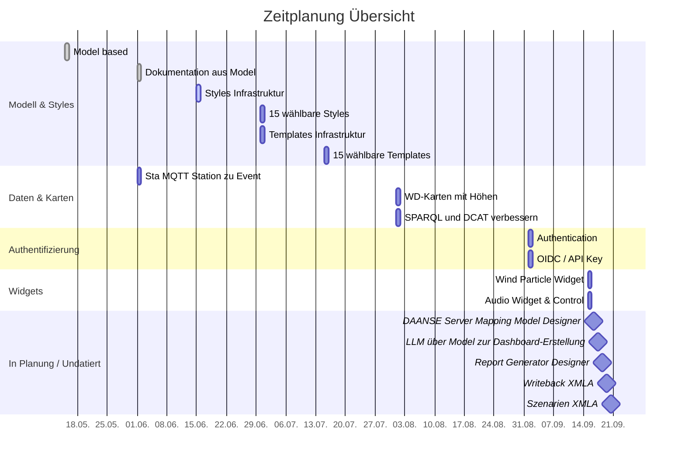

# Eclipse Daanse – Die neue Generation datengetriebener Dashboards

Eclipse Daanse ist ein vollständig clientseitiger Dashboard-Editor und Viewer, der speziell für die moderne Verwaltung, Analyse und Visualisierung heterogener Datenquellen entwickelt wurde. Im Gegensatz zu klassischen Lösungen wie **Grafana** oder **Apache Superset** verfolgt Daanse einen konsequenten *No-Server-Ansatz*, was insbesondere im Bereich *Open Data* und *Smart City* neue Maßstäbe setzt.

---

## 🆚 Vergleich Eclipse Daanse vs. Grafana vs. Apache Superset

| Merkmal | Eclipse Daanse | Grafana | Apache Superset |
|--------|----------------|---------|------------------|
| **Open Source** | ✅ | ✅ | ✅ |
| **Server notwendig** | ❌ | ✅ | ✅ |
| **Datenverarbeitung im Browser (Client only)** | ✅ | ❌ | ❌ |
| **Granulare Widgetgestaltung** | ✅ pixelgenau & responsive | ⚠️ begrenzt | ⚠️ begrenzt |
| **Responsive & pixelgenaue Dashboards** | ✅ | ⚠️ begrenzt | ⚠️ begrenzt |
| **Komplexe Layouts / Infografics** | ✅ | ⚠️ Plugin-basiert | ⚠️ beschränkt |
| **Datenquellen in einem Widget kombinierbar (live, historisch, statisch)** | ✅ | ⚠️ nur über Plugins | ⚠️ mit SQL |
| **Offlinefähig / Desktop App (MacOS, Windows, Linux)** | ✅ | ⚠️ begrenzt | ❌ |
| **PivotTables (OLAP Cube Visualisierung)** | ✅ | ⚠️ (via Plugin) | ⚠️ (teilweise) |
| **Kartenintegration (OGC Maps & Features)** | ✅ | ⚠️ Plugin-abhängig | ⚠️ kaum |
| **MQTT/WebSocket Unterstützung (nativ)** | ✅ | ⚠️ (nur Plugins) | ❌ |
| **Direkte Nutzung offener Schnittstellen / Endpointfinder** | ✅ | ⚠️ oft nur mit eigenem Backend | ⚠️ teilweise |
| **SensorThings API (Live, Historie, Stammdaten)** | ✅ | ⚠️ experimentell | ❌ |
| **SPARQL / RDF / Linked Open Data** | ✅ | ❌ | ⚠️ experimentell |
| **GraphQL (inkl. Subscription geplant)** | ✅ | ⚠️ | ⚠️ |
| **XMLA für OLAP-Cubes** | ✅ | ⚠️ Plugin-abhängig | ⚠️ experimentell |
| **SQL über XMLA mit Rechtemanagement** | ✅ | ❌ | ❌ |
| **Integration von Open Data Registries (DCAT)** | ✅ | ❌ | ❌ |
| **Git-Versionierung für Dashboards** | ✅ | ❌ | ❌ |
| **Datenschutz ohne doppeltes Rechtemanagement** | ✅ | ❌ | ❌ |

------

## 🖼️ Dashboards

- **Pixelgenaue Platzierung**: Jedes Widget kann absolut positioniert werden. Komplexe Layouts wie Infografiken oder mehrseitige Reports möglich
- **Responsives Layout**: Widget-Größen sind fix, aber die Positionierung passt sich an das jeweilige Endgerät an.

---

## 🧩 Verfügbare Widgets
### Basis-Widgets
- Rahmen, Abrundungen, Schatten sowie Transparenzen von Hintergrund und Schrift können individuell eingestellt werden. Farben und Schattenverläufe lassen sich zudem dynamisch über Variablen steuern – etwa abhängig von der Tageszeit. So kann beispielsweise die Ausrichtung und Länge eines Schattens oder die Helligkeit eines Widgets automatisch dem Sonnenstand angepasst werden.
- *Farben, Schatten und Transparenz dynamisch nach Uhrzeit und Variablen steuerbar.*

### Chart-Widgets
- Balkendiagramme 
- Liniendiagramme 
- Kreisdiagramme 

### Datentabellen
- Sortierung und Filterung pro Spalte
- Paginierung
- Spalten- und Zeilenformatierung
- Hervorhebung (Highlighting)
- Exportfunktionen (z. B. CSV)

### PivotTable (Excel-ähnlich)
- Auswahl eines OLAP-Cubes
- Frei konfigurierbare Dimensionen (Spalten, Zeilen, Filter)
- Measures (Kennzahlen) dynamisch einsetzbar
- Export der erzeugten Aggregationen
- Ideal für interaktive BI-Analysen.

### Icons
- Auswahl aus vordefinierten Symbolkatalogen
- Anpassung von Vorder- und Hintergrundfarben
- Nutzen von Icons zur semantischen Codierung von Zuständen.

### Image
- Darstellung von Bildern
- Anwendung von Bildfiltern wie Kontrast, Helligkeit, Unschärfe etc.
- Skalierung und Rahmung frei wählbar.

### Progress Bars & Gauges
- Visualisierung einfacher Messwerte
- Darstellung als Tacho, Fortschrittsbalken oder Zahl.
- Ideal für KPIs wie Geschwindigkeit, Temperatur, Auslastung.

### SVG
- Einbettung und Darstellung von SVG-Grafiken
- Farbmanipulation über Variablen
- Perfekt für stilisierte Icons und Vektorformen.

### Repeatable SVG
- Wiederholte Darstellung von SVGs anhand numerischer Werte
- Beispiel: 10 Personen als Symbol für einen Zählerstand
- Beliebige SVGs können verwendet werden, nicht nur Icons.
- einfache Darstellung von Mengeverhältnissen oder Skalen (Bewertung 3 von 5 Sternen)

### RichText
- Formatierter Text mit Einbettung von Variablen
- Freie Platzierung im Dashboard
- Einsatz für Überschriften, erklärende Texte oder interaktive Labels.

### Text
- Schlichter Text ohne Formatierung
- Integration von Variablen (z. B. dynamische Messwerte)
- Nützlich für einfache Beschriftungen

### Video
- Darstellung von Videos mit oder ohne Steuerungsbuttons
- Einbettung von Livestreams möglich

### Karten (Map)
- Darstellung georeferenzierter Daten
- Integration von:
  - OGC Maps (gerenderte Kartenbilder)
  - OGC Features (Geo-Objekte mit Attributen)
  - SensorThings-Standorten
  - CSV- und CML-Datenquellen
  - XMLA
- Individuelles Styling für alle Layer (Färbung, Transpartenz, Icons, Linien, Flächen, Sensorwerte)
- alle Layer gemeinsam darstellbar

### SampleWidget
- Platzhalter für zukünftige experimentelle Widgets
- zeigt nativ die Rohdaten der Connection an

---

## 🔌 Datenverbindungen (Connections)

### OGC Maps
- Einbindung gerenderter Karten (z. B. WMS-Dienste)
- Anzeige in Kartenwidgets

### OGC Features
- Anzeige von Geo-Objekten wie Haltestellen, Gullideckeln, Bäumen etc.
- JSON-basiert
- Mit Geometrie, Name und Stammdaten

### SensorThings API
- Historische Zeitreihen (z. B. Temperaturverlauf)
- Sensorstammdaten (Typ, Standort, Einheit)
- Live-Daten über REST oder MQTT/Websocket
- Perfekt für Smart-City-Anwendungen.

### XMLA für Datacubes
- Zugriff auf Datenwürfel über XMLA-Schnittstelle
- Unterstützt Microsoft Analysis Services, Daanse OLAP Server u. a.
- Kompatibel mit PowerBI und Excel Pivot.

### SQL über XMLA
- Ausführung von SQL-Statements über XMLA-Protokoll
- Rollenbasiertes Rechtemanagement
- Sicherheitsfunktionen gegen Missbrauch

### REST CSV
- REST-Schnittstelle zum Import von CSV-Dateien
- Auswahl von Delimiter
- Teilweises Einlesen großer Dateien möglich (Bereiche)

### REST JSON & XML
- Einfache REST-Anbindung für gängige APIs
- Unterstützt JSON und XML
- Kompatibel mit Open Government APIs, z. B. Mängelmelder, Verkehrsdaten.

### Semantic Web / SPARQL / RDF
- Zugriff auf Wikidata, DCAT, GovData, Open Energy Platform etc.
- Nutzung semantischer Abfragen über SPARQL
- Verknüpfung mit Linked Open Data.

### MQTT (plain)
- Direkte Verbindung zu MQTT-Brokern
- Empfängt Nachrichten bei Wertänderung
- Unterstützt Last-Will-Nachrichten

### WebSocket (plain)
- Direkter Empfang von Nachrichten via WebSocket-Protokoll
- Verbindung zu Webservern möglich, z. B. bei Custom Events.

### RSS
- Einbindung strukturierter RSS-Feeds
- Darstellung von Datum, Kurztext, Langtext, Link
- Ideal für Veranstaltungskalender, Fahrplanänderungen etc.

### GraphQL
- Moderne, webbasierte Abfragesprache
- Selektives Abfragen und Filtern von Feldern
- Subscriptions (Live-Daten)

---

## 🔁 Variablen

- **Konstanten** (z. B. ID eines Sensors)
- **Berechnete Variablen** (Formeln auf andere Variablen)
- **Zeitbasierte Variablen** (z. B. Sonnenstand, Uhrzeit)
- **Ergebnisse aus Abfragen** (z. B. aktuelle Temperatur)

Alle Eigenschaften von Widgets und Dashboards sind variablenfähig.

Beispiel: Eine Schaltfläche wechselt zwischen verschiedenen Objekten, indem eine Variable aktualisiert wird. Alle Datenquellen passen sich automatisch an.

---

## ✨ Besonderheiten

### Kein Server nötig
- Läuft direkt im Browser
- Kann als PWA oder native Desktop-App (macOS, Windows, Linux) genutzt werden ()
- Kein Backend, keine Serverkosten, volle Datensouveränität

### 🛡️ Datenschutz und Rechte – ein entscheidender Vorteil der Client-basierten Lösung

Bei Eclipse Daanse erfolgt die gesamte Datenverarbeitung direkt im Browser – ohne zwischengeschalteten Server. Die Daten werden über offene Schnittstellen geladen und unmittelbar auf dem Endgerät des Nutzers visualisiert.  

Gerade im Kontext von **Open-Data- oder Urban-Data-Plattformen**, bei denen Daten über klar definierte öffentliche APIs bereitgestellt werden, ist das ein großer Vorteil:  
Es entfällt die Notwendigkeit, Daten ein zweites Mal zu speichern oder durch einen Server zu schleusen – und damit auch das Risiko doppelter Rechtestrukturen.

Im Gegensatz dazu benötigen serverbasierte Systeme wie **Grafana** oder **Apache Superset** häufig einen zentralen Nutzerzugang mit weitreichenden Rechten, um auf die zugrundeliegenden Schnittstellen zugreifen zu können.  
Dieser technische „Superuser" sieht oft mehr als vorgesehen – insbesondere wenn daraufhin ein separates Rechtemanagement in der Dashboard-Anwendung aufgebaut wird, das nicht mit dem originalen API-Rechtesystem übereinstimmt.  

Das birgt ein erhebliches Sicherheitsrisiko: Ein Nutzer der Dashboard-Anwendung kann ungewollt Zugriff auf Daten erhalten, die er über die ursprüngliche API nie sehen dürfte.

**Daanse vermeidet dieses Problem vollständig** – durch direkten, autorisierten Zugriff aus dem Browser und durch Verzicht auf eigene Serverinfrastruktur.

### 🌍 Direkter Zugriff auf Open Data aus DCAT-Katalogen

In Open-Data-Plattformen wie [data.europa.eu](https://data.europa.eu) oder [GovData.de](https://www.govdata.de) werden alle Datensätze und Dienste standardisiert im **DCAT-Schema** beschrieben.  

Der Daanse Board-Client kann diese öffentlichen **DCAT-Registries direkt abfragen** – etwa nach Begriffen wie *„Feuerwehreinsätze"*.  
Gefundene Datensätze oder Dienste können unmittelbar eingebunden und visualisiert werden – ganz ohne aufwendige Schnittstellenkonfiguration.

Beim Erstellen eines Dashboards wird für jede ausgewählte Datenquelle automatisch eine Liste passender Widgets vorgeschlagen.  
Diese muss man nur noch auswählen – und erhält sofort eine fertige Visualisierung.

➡️ **Schneller, intuitiver und direkter Zugriff auf die gesamte Welt offener Daten.**

### Datenfusion in Dashboard & Widgets
- Kombination unterschiedlicher Datenquellen in einem Dashboard (z. B. Live-Sensorik + Geodaten + Statistik)
- Kombination in einem Widget (z. B. Karte mit Live- & historischen Daten, Tabelle mit CSV + SQL + GraphQL)

### Git-Integration
- Dashboards versionierbar und nachvollziehbar
- Unterschiedliche Varianten möglich (z. B. Fraktionen im Stadtrat)
- *Änderungen sind dokumentiert und auditierbar*

Alle Daten können transparent angezeigt werden, während Dashboards zum selben Thema und mit denselben Datenquellen individuell gestaltet werden können.
So kann beispielsweise jede Fraktion eines Stadtrats ihr eigenes Dashboard erstellen und dabei eine eigene inhaltliche Perspektive („Framing“) wählen – ohne dass sich die zugrundeliegenden Daten unterscheiden. Für die Nutzer bleibt stets nachvollziehbar, was die originalen Daten sind und worin sich die verschiedenen Darstellungen der Fraktionen unterscheiden.

Änderungen an Dashboards sind stets nachvollziehbar und auditierbar: Es lässt sich jederzeit nachvollziehen, wer wann was geändert hat. Zudem können Änderungen begründet und dokumentiert werden.

---

## 🔧 Geplante Erweiterungen

### 🧩 Widgets

- **Markdown**  
  Widget zur Darstellung von Markdown-Texten mit Unterstützung für Formatierungen, Listen, Tabellen und Codeblöcke. Ideal für Erläuterungen, Dokumentationen oder redaktionelle Inhalte.

- **Mermaid.js**  
  Visualisierung komplexer Diagramme wie Flussdiagramme, Gantt-Charts oder Zustandsdiagramme durch direkte Mermaid-Syntax im Widget.

- **Kartenerweiterungen**  
  - **GLM (Geolokale Modelle)**: Darstellung hochauflösender Layer z. B. für städtische Pläne oder Topografie.  
  - **Routing & Wegematrizen**: Integration externer Routing-APIs zur Darstellung von Wegen, Entfernungen oder Fahrplänen auf Karten.  
  - **Legenden für Karten**: Automatische oder manuelle Legenden passend zu Karteninhalten (Farben, Symbole etc.).

- **KPI-Widget für OLAP/XMLA**  
  Kompakte Anzeige von Kennzahlen aus XMLA- oder OLAP-Datenquellen – tabellarisch, gruppierbar, filterbar und mit Suchfunktion.

- **Nutzerdefinierte JavaScript-Actions**  
  Möglichkeit zur Erweiterung der Funktionalität von Widgets durch benutzerdefinierte JavaScript-Funktionen (z. B. bei Interaktionen oder Triggern).

- **Icon-Umschalter**  
  Umschalten von Symbolen in Abhängigkeit von Variablen, Status oder Nutzeraktionen – etwa für einfache Statusvisualisierung.

- **3D-Gebäudeanzeige (BIM/IFC)**  
  Integration eines 3D-Viewers zur Anzeige von Gebäudemodellen nach IFC-Standard, verknüpfbar mit Live-Sensorik über SensorThings API.

- **Wetter-Widget mit Animation**  
  Darstellung aktueller Wetterdaten mit animierten Hintergründen (z. B. Regen, Sonne, Wind).

- **Taschenlampen-Effekt**  
  Interaktive Lichtquelle, die nur einen bestimmten Bereich der Benutzeroberfläche aufhellt – nützlich für fokussierte Präsentationen oder „Dark Mode“-Effekte.

- **Schneeflocken-Widget**  
  Animation fallender Schneeflocken, die sich visuell auf Widgets ablegen – ideal für saisonale Designs.

- **Chat zu Daten (LLM-Integration)**  
  Intelligenter Chatbot, der Fragen zu den im Dashboard verfügbaren Daten beantworten kann – unterstützt durch ein Sprachmodell (LLM).

- **KI-Wizard zur Dashboard-Erstellung**  
  Schritt-für-Schritt-Assistent basierend auf KI, der automatisch ein Dashboard erstellt – basierend auf den Datenquellen, Verbindungen und Zielgruppen.

- **Source-Code-Highlighting**  
  Widget zur Darstellung und farblichen Hervorhebung von Quellcode in verschiedenen Sprachen – ideal für Dev-Dashboards oder Dokumentationen.

- **Word Cloud aus OLAP-Daten**  
  Generierung dynamischer Wortwolken aus Textfeldern oder aggregierten Inhalten eines Datenwürfels – filterbar nach OLAP-Dimensionen.

- **3D-Cube-Verteilungsdiagramm** 
  Visualisierung der Datenverteilung innerhalb eines OLAP-Cubes in Form eines dreidimensionalen Würfels. Dabei repräsentieren die Dimensionen des Würfels die Achsen des Datenraums, während die Größe oder Farbe einzelner Elemente (z. B. Würfelzellen) die Ausprägung eines bestimmten Measures (z. B. Anzahl, Summe, Durchschnitt) darstellen.
  Diese Darstellung ermöglicht ein intuitives Verständnis darüber, wie sich Werte im Cube verteilen, und hilft dabei, Konzentrationen, Lücken oder Muster in den Daten visuell zu erfassen.

### 🎨 Layout & Styles

- **Raster & Magnetfunktion**  
  Widgets rasten automatisch am Raster ein – für sauberes und ausgerichtetes Layout.

- **Kopieren & Einfügen**  
  Duplizieren von Widgets oder ganzen Layoutabschnitten zur schnellen Wiederverwendung.

- **Rückgängig / Wiederholen**  
  Vollständige Undo/Redo-Unterstützung für alle Aktionen im Dashboard-Editor.

- **Animations-Editor**  
  Visuelle Erstellung zeitgesteuerter Abläufe oder Übergänge zwischen Zuständen und Werten.

- **Verbindungslinien (Wires)**  
  Zeichnen von Linien zwischen Widgets mit Farbe, Stil oder Sichtbarkeit basierend auf Sensorwerten oder Variablen.

- **Shortcuts zur Bedienung**  
  Tastenkürzel zur schnellen Navigation und Bearbeitung im Editor.

- **Präsentationsmodus / Vollbild**  
  Vollbildanzeige oder Vorschau-Modus ohne Editorrahmen – ideal für Vorträge oder Infomonitore.

- **Layer & Gruppen**  
  Organisation von Widgets in Ebenen – mit Optionen zum Sperren, Ein-/Ausblenden oder Gruppieren.

- **DPI/PPI-Anpassung**  
  Anpassung der Darstellung für verschiedene Bildschirmauflösungen – ideal für Druckansicht oder große Monitore.

- **Matrix-Hintergrund**  
  Dekorativer Hintergrund mit animierten Zeichen oder individuell einstellbaren Wörtern (z. B. für Mottos, Begriffe).

- **Design-Vorlagen & Stylesystem**  
  Einführung eines zentralen Stylesystems zur konsistenten Gestaltung von Widgets. Designs orientieren sich an einem übergeordneten Thema (z. B. "Wood", "Dark Mode", "Stadtverwaltung", "Barrierefrei", "Comic").  
  Es werden mehrere vordefinierte Stile mitgeliefert – eigene können individuell erstellt und gespeichert werden.

- **Template-System für Dashboard-Layouts**  
  Ermöglicht das Speichern und Wiederverwenden von Widget-Positionierungen und Layoutstrukturen.  
  So lassen sich grafische Anordnung und Datenanbindung voneinander trennen – ideal für die Erstellung hochwertiger Infografiken mit konsistenter Struktur.

### ⚙️ Workflow

- **Datenschutz-Dokumentation generieren**  
  Automatisches Erzeugen von Datenschutztexten aus den im Dashboard genutzten Datenquellen und Verbindungen.

- **No-Code-Editor für Logik**  
  Visuelles Interface zur Erstellung von Bedingungen, Schleifen und Variablenoperationen – ganz ohne Programmierung.

- **Datenexport-Funktionen**  
  Export von Einzeldaten oder vollständigen Datensätzen aus beliebigen Connections – z. B. als CSV oder JSON.

- **Standortabfrage aus Browser**  
  Nutzung der aktuellen Position des Nutzers zur Filterung oder Platzierung von Daten – z. B. bei Karten, SPARQL-Endpunkten oder Sensor-APIs.

- **Berichtsgenerierung (Pagelayout)**  
  Positionen von Texten, Tabellen und Grafiken werden im Seitenlayout festgelegt und mithilfe externer Engines wie *JasperReports* oder *PDFBox* automatisiert als PDF generiert.

- **Strukturierter Berichtseditor**  
  Erstellung vollständiger Report-Dokumente mit Kapiteln, Fließtexten, Tabellen und Wiederholungen. Datensätze (z. B. einzelne Zeilen) können automatisch in Kapitel oder Abschnitte umgesetzt und im Bericht korrekt platziert werden.

### 🌐 Connections (geplant)

- **WebRTC**  
  Direkte Peer-to-Peer-Verbindungen für Live-Kommunikation oder Datenaustausch – z. B. für Video, Audio oder Kollaboration.

- **Geo-Routing API**  
  Integration externer Routingdienste für Wegberechnung, Verkehrsauskunft und Entfernungsmatrix – als eigenständige Datenquelle nutzbar.

- **Prometheus-/PromQL-Unterstützung**  
  Integration von Prometheus als Datenquelle inklusive der leistungsfähigen PromQL-Abfragesprache über eine Webschnittstelle – ideal zur Einbindung von Metriken und Zeitreihendaten aus Monitoring-Systemen.

- **Elasticsearch / OpenSearch**  
  Direkte Anbindung von Elasticsearch- oder OpenSearch-Indizes. Abfragen erfolgen über die native Suchsyntax, sodass strukturierte sowie unstrukturierte Daten einfach eingebunden und visualisiert werden können.

### 📱 Geräte-Support

- **iOS**  
  Unterstützung für iPhones und iPads als installierbare Web-App oder native PWA.

- **Android**  
  Voll funktionsfähige Unterstützung auf Android-Smartphones und -Tablets – inklusive Sensornutzung.

- **Linux (Flatpak)**  
  Paketierung des Clients als Flatpak zur einfachen Installation auf Linux-Desktops (z. B. Ubuntu, Fedora).

---

## Zeitplan

## 🚀 Fazit

**Eclipse Daanse** ist keine bloße Dashboard-Alternative, sondern ein **komplett neu gedachtes Visualisierungs-Framework**, das alle Anforderungen moderner Datenplattformen – insbesondere im Open- und Urban-Data-Kontext – erfüllt:

- **Datenschutzkonform**, **granular**, **hochflexibel**, **vollständig clientbasiert**.
- Kein Vendor-Lock-In, keine Serverkosten, volle Kontrolle.

> *Wer Open Data wirklich offen nutzen will, braucht eine Lösung wie Daanse.*

----

