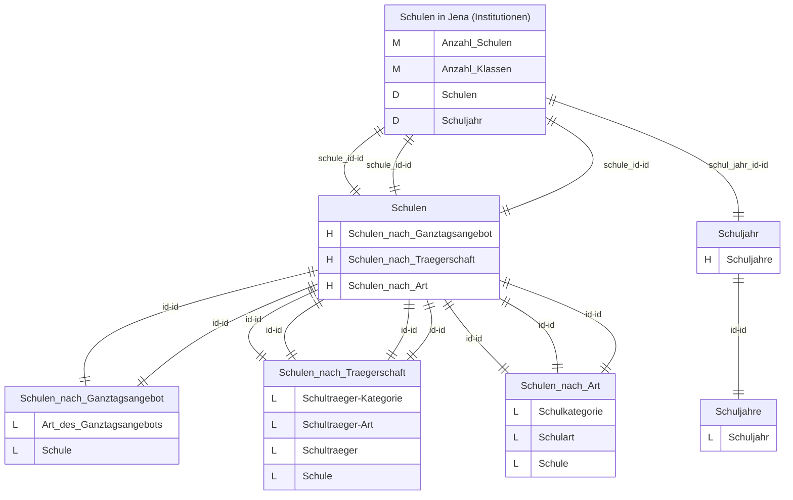
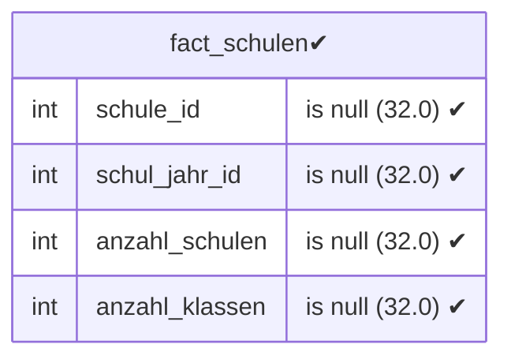
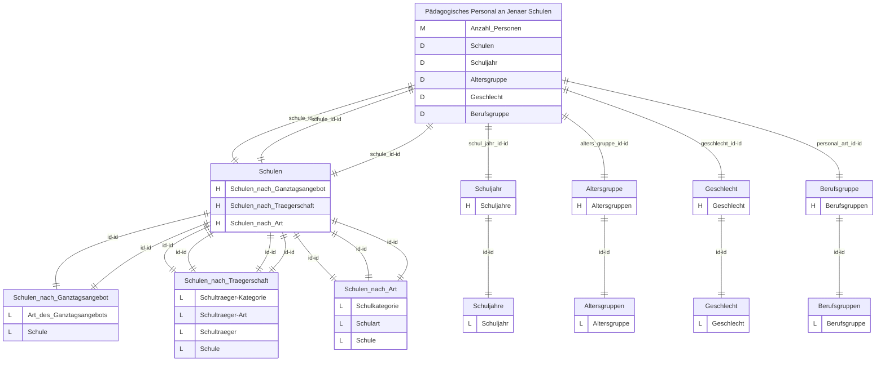
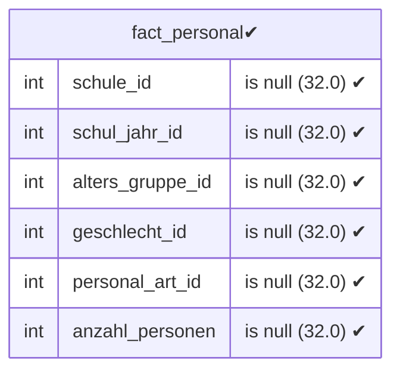
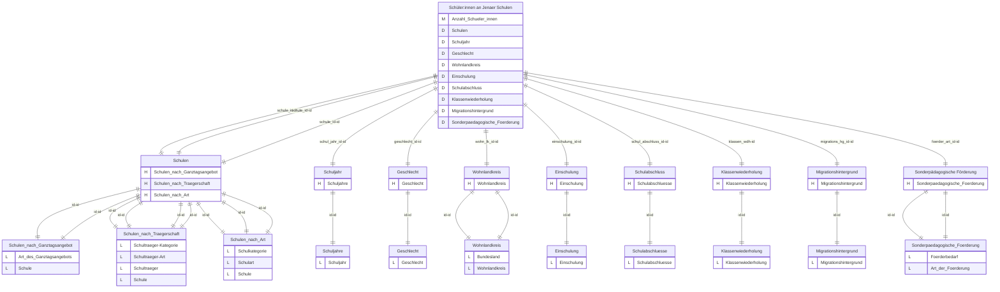
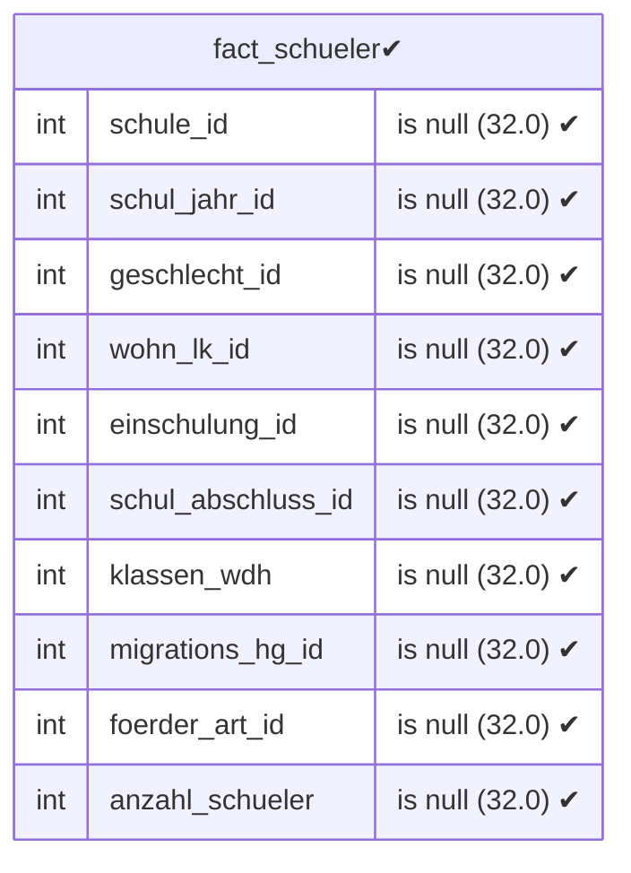
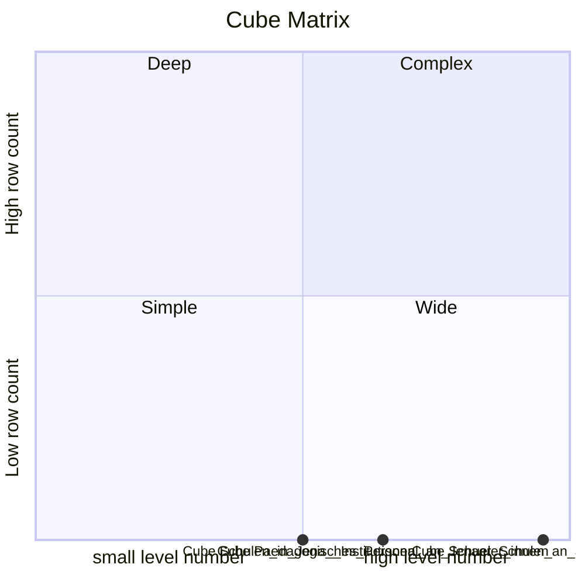

```mermaid
---
title: Diagram;
---
erDiagram
"alters_gruppe✔"{
int id "is null (32.0) ✔"
string altersgruppe "is null (1000000000.0) ✔"
}
"bundesland✔"{
int id "is null (32.0) ✔"
string kuerzel "is null (1000000000.0) ✔"
string bezeichnung "is null (1000000000.0) ✔"
}
"einschulung✔"{
int id "is null (32.0) ✔"
string einschulung "is null (1000000000.0) ✔"
}
"fact_personal✔"{
int schule_id "is null (32.0) ✔"
int schul_jahr_id "is null (32.0) ✔"
int alters_gruppe_id "is null (32.0) ✔"
int geschlecht_id "is null (32.0) ✔"
int personal_art_id "is null (32.0) ✔"
int anzahl_personen "is null (32.0) ✔"
}
"fact_schueler✔"{
int schule_id "is null (32.0) ✔"
int schul_jahr_id "is null (32.0) ✔"
int geschlecht_id "is null (32.0) ✔"
int wohn_lk_id "is null (32.0) ✔"
int einschulung_id "is null (32.0) ✔"
int schul_abschluss_id "is null (32.0) ✔"
int klassen_wdh "is null (32.0) ✔"
int migrations_hg_id "is null (32.0) ✔"
int foerder_art_id "is null (32.0) ✔"
int anzahl_schueler "is null (32.0) ✔"
}
"fact_schulen✔"{
int schule_id "is null (32.0) ✔"
int schul_jahr_id "is null (32.0) ✔"
int anzahl_schulen "is null (32.0) ✔"
int anzahl_klassen "is null (32.0) ✔"
}
"foerderung_art✔"{
int id "is null (32.0) ✔"
string foerderung_art "is null (1000000000.0) ✔"
int sp_foerderbedarf_id "is null (32.0) ✔"
}
"ganztags_art✔"{
int id "is null (32.0) ✔"
string schul_umfang "is null (1000000000.0) ✔"
}
"geschlecht✔"{
int id "is null (32.0) ✔"
string kuerzel "is null (1000000000.0) ✔"
string bezeichnung "is null (1000000000.0) ✔"
}
"klassen_wiederholung✔"{
int id "is null (32.0) ✔"
string klassenwiederholung "is null (1000000000.0) ✔"
}
"migrations_hintergrund✔"{
int id "is null (32.0) ✔"
string migrations_hintergrund "is null (1000000000.0) ✔"
}
"personal_art✔"{
int id "is null (32.0) ✔"
string bezeichnung "is null (1000000000.0) ✔"
}
"schul_abschluss✔"{
int id "is null (32.0) ✔"
string schulabschluss "is null (1000000000.0) ✔"
}
"schul_art✔"{
int id "is null (32.0) ✔"
string schulart_name "is null (1000000000.0) ✔"
int schul_kategorie_id "is null (32.0) ✔"
}
"schul_jahr✔"{
int id "is null (32.0) ✔"
string schul_jahr "is null (1000000000.0) ✔"
int order "is null (32.0) ✔"
}
"schul_kategorie✔"{
int id "is null (32.0) ✔"
string schul_kategorie_name "is null (1000000000.0) ✔"
}
"schule✔"{
int id "is null (32.0) ✔"
int schul_nummer "is null (32.0) ✔"
string schul_name "is null (1000000000.0) ✔"
int traeger_id "is null (32.0) ✔"
int schul_art_id "is null (32.0) ✔"
int ganztags_art_id "is null (32.0) ✔"
}
"sonderpaed_foerderbedarf✔"{
int id "is null (32.0) ✔"
string sonderpaed_bedarf "is null (1000000000.0) ✔"
}
"traeger✔"{
int id "is null (32.0) ✔"
string traeger_name "is null (1000000000.0) ✔"
int traeger_art_id "is null (32.0) ✔"
}
"traeger_art✔"{
int id "is null (32.0) ✔"
string traeger_art "is null (1000000000.0) ✔"
string traeger_kat_id "is null (1000000000.0) ✔"
}
"traeger_kategorie✔"{
int id "is null (32.0) ✔"
string traeger_kategorie "is null (1000000000.0) ✔"
}
"wohnort_landkreis✔"{
int id "is null (32.0) ✔"
string kuerzel "is null (1000000000.0) ✔"
string bezeichnung "is null (1000000000.0) ✔"
int bundesland_id "is null (32.0) ✔"
}

"fact_schulen✔" ||--o{ "schule✔" : "schule_id-id"
"schule✔" ||--o{ "ganztags_art✔" : "ganztags_art_id-id"
"fact_schulen✔" ||--o{ "schule✔" : "schule_id-id"
"schule✔" ||--o{ "traeger✔" : "traeger_id-id"
"traeger✔" ||--o{ "traeger_art✔" : "traeger_art_id-id"
"traeger_art✔" ||--o{ "traeger_kategorie✔" : "traeger_kat_id-id"
"fact_schulen✔" ||--o{ "schule✔" : "schule_id-id"
"schule✔" ||--o{ "schul_art✔" : "schul_art_id-id"
"schul_art✔" ||--o{ "schul_kategorie✔" : "schul_kategorie_id-id"
"fact_schulen✔" ||--o{ "schul_jahr✔" : "schul_jahr_id-id"
"fact_personal✔" ||--o{ "schule✔" : "schule_id-id"
"schule✔" ||--o{ "ganztags_art✔" : "ganztags_art_id-id"
"fact_personal✔" ||--o{ "schule✔" : "schule_id-id"
"schule✔" ||--o{ "traeger✔" : "traeger_id-id"
"traeger✔" ||--o{ "traeger_art✔" : "traeger_art_id-id"
"traeger_art✔" ||--o{ "traeger_kategorie✔" : "traeger_kat_id-id"
"fact_personal✔" ||--o{ "schule✔" : "schule_id-id"
"schule✔" ||--o{ "schul_art✔" : "schul_art_id-id"
"schul_art✔" ||--o{ "schul_kategorie✔" : "schul_kategorie_id-id"
"fact_personal✔" ||--o{ "schul_jahr✔" : "schul_jahr_id-id"
"fact_personal✔" ||--o{ "alters_gruppe✔" : "alters_gruppe_id-id"
"fact_personal✔" ||--o{ "geschlecht✔" : "geschlecht_id-id"
"fact_personal✔" ||--o{ "personal_art✔" : "personal_art_id-id"
"fact_schueler✔" ||--o{ "schule✔" : "schule_id-id"
"schule✔" ||--o{ "ganztags_art✔" : "ganztags_art_id-id"
"fact_schueler✔" ||--o{ "schule✔" : "schule_id-id"
"schule✔" ||--o{ "traeger✔" : "traeger_id-id"
"traeger✔" ||--o{ "traeger_art✔" : "traeger_art_id-id"
"traeger_art✔" ||--o{ "traeger_kategorie✔" : "traeger_kat_id-id"
"fact_schueler✔" ||--o{ "schule✔" : "schule_id-id"
"schule✔" ||--o{ "schul_art✔" : "schul_art_id-id"
"schul_art✔" ||--o{ "schul_kategorie✔" : "schul_kategorie_id-id"
"fact_schueler✔" ||--o{ "schul_jahr✔" : "schul_jahr_id-id"
"fact_schueler✔" ||--o{ "geschlecht✔" : "geschlecht_id-id"
"fact_schueler✔" ||--o{ "wohnort_landkreis✔" : "wohn_lk_id-id"
"wohnort_landkreis✔" ||--o{ "bundesland✔" : "bundesland_id-id"
"fact_schueler✔" ||--o{ "einschulung✔" : "einschulung_id-id"
"fact_schueler✔" ||--o{ "schul_abschluss✔" : "schul_abschluss_id-id"
"fact_schueler✔" ||--o{ "klassen_wiederholung✔" : "klassen_wdh-id"
"fact_schueler✔" ||--o{ "migrations_hintergrund✔" : "migrations_hg_id-id"
"fact_schueler✔" ||--o{ "foerderung_art✔" : "foerder_art_id-id"
"foerderung_art✔" ||--o{ "sonderpaed_foerderbedarf✔" : "sp_foerderbedarf_id-id"
```

```mermaid
---
title: Diagram;
---
erDiagram
"alters_gruppe✔"{
int id "is null (32.0) ✔"
string altersgruppe "is null (1000000000.0) ✔"
}
"bundesland✔"{
int id "is null (32.0) ✔"
string kuerzel "is null (1000000000.0) ✔"
string bezeichnung "is null (1000000000.0) ✔"
}
"einschulung✔"{
int id "is null (32.0) ✔"
string einschulung "is null (1000000000.0) ✔"
}
"fact_personal✔"{
int schule_id "is null (32.0) ✔"
int schul_jahr_id "is null (32.0) ✔"
int alters_gruppe_id "is null (32.0) ✔"
int geschlecht_id "is null (32.0) ✔"
int personal_art_id "is null (32.0) ✔"
int anzahl_personen "is null (32.0) ✔"
}
"fact_schueler✔"{
int schule_id "is null (32.0) ✔"
int schul_jahr_id "is null (32.0) ✔"
int geschlecht_id "is null (32.0) ✔"
int wohn_lk_id "is null (32.0) ✔"
int einschulung_id "is null (32.0) ✔"
int schul_abschluss_id "is null (32.0) ✔"
int klassen_wdh "is null (32.0) ✔"
int migrations_hg_id "is null (32.0) ✔"
int foerder_art_id "is null (32.0) ✔"
int anzahl_schueler "is null (32.0) ✔"
}
"fact_schulen✔"{
int schule_id "is null (32.0) ✔"
int schul_jahr_id "is null (32.0) ✔"
int anzahl_schulen "is null (32.0) ✔"
int anzahl_klassen "is null (32.0) ✔"
}
"foerderung_art✔"{
int id "is null (32.0) ✔"
string foerderung_art "is null (1000000000.0) ✔"
int sp_foerderbedarf_id "is null (32.0) ✔"
}
"ganztags_art✔"{
int id "is null (32.0) ✔"
string schul_umfang "is null (1000000000.0) ✔"
}
"geschlecht✔"{
int id "is null (32.0) ✔"
string kuerzel "is null (1000000000.0) ✔"
string bezeichnung "is null (1000000000.0) ✔"
}
"klassen_wiederholung✔"{
int id "is null (32.0) ✔"
string klassenwiederholung "is null (1000000000.0) ✔"
}
"migrations_hintergrund✔"{
int id "is null (32.0) ✔"
string migrations_hintergrund "is null (1000000000.0) ✔"
}
"personal_art✔"{
int id "is null (32.0) ✔"
string bezeichnung "is null (1000000000.0) ✔"
}
"schul_abschluss✔"{
int id "is null (32.0) ✔"
string schulabschluss "is null (1000000000.0) ✔"
}
"schul_art✔"{
int id "is null (32.0) ✔"
string schulart_name "is null (1000000000.0) ✔"
int schul_kategorie_id "is null (32.0) ✔"
}
"schul_jahr✔"{
int id "is null (32.0) ✔"
string schul_jahr "is null (1000000000.0) ✔"
int order "is null (32.0) ✔"
}
"schul_kategorie✔"{
int id "is null (32.0) ✔"
string schul_kategorie_name "is null (1000000000.0) ✔"
}
"schule✔"{
int id "is null (32.0) ✔"
int schul_nummer "is null (32.0) ✔"
string schul_name "is null (1000000000.0) ✔"
int traeger_id "is null (32.0) ✔"
int schul_art_id "is null (32.0) ✔"
int ganztags_art_id "is null (32.0) ✔"
}
"sonderpaed_foerderbedarf✔"{
int id "is null (32.0) ✔"
string sonderpaed_bedarf "is null (1000000000.0) ✔"
}
"traeger✔"{
int id "is null (32.0) ✔"
string traeger_name "is null (1000000000.0) ✔"
int traeger_art_id "is null (32.0) ✔"
}
"traeger_art✔"{
int id "is null (32.0) ✔"
string traeger_art "is null (1000000000.0) ✔"
string traeger_kat_id "is null (1000000000.0) ✔"
}
"traeger_kategorie✔"{
int id "is null (32.0) ✔"
string traeger_kategorie "is null (1000000000.0) ✔"
}
"wohnort_landkreis✔"{
int id "is null (32.0) ✔"
string kuerzel "is null (1000000000.0) ✔"
string bezeichnung "is null (1000000000.0) ✔"
int bundesland_id "is null (32.0) ✔"
}

"fact_schulen✔" ||--o{ "schule✔" : "schule_id-id"
"schule✔" ||--o{ "ganztags_art✔" : "ganztags_art_id-id"
"fact_schulen✔" ||--o{ "schule✔" : "schule_id-id"
"schule✔" ||--o{ "traeger✔" : "traeger_id-id"
"traeger✔" ||--o{ "traeger_art✔" : "traeger_art_id-id"
"traeger_art✔" ||--o{ "traeger_kategorie✔" : "traeger_kat_id-id"
"fact_schulen✔" ||--o{ "schule✔" : "schule_id-id"
"schule✔" ||--o{ "schul_art✔" : "schul_art_id-id"
"schul_art✔" ||--o{ "schul_kategorie✔" : "schul_kategorie_id-id"
"fact_schulen✔" ||--o{ "schul_jahr✔" : "schul_jahr_id-id"
"fact_personal✔" ||--o{ "schule✔" : "schule_id-id"
"schule✔" ||--o{ "ganztags_art✔" : "ganztags_art_id-id"
"fact_personal✔" ||--o{ "schule✔" : "schule_id-id"
"schule✔" ||--o{ "traeger✔" : "traeger_id-id"
"traeger✔" ||--o{ "traeger_art✔" : "traeger_art_id-id"
"traeger_art✔" ||--o{ "traeger_kategorie✔" : "traeger_kat_id-id"
"fact_personal✔" ||--o{ "schule✔" : "schule_id-id"
"schule✔" ||--o{ "schul_art✔" : "schul_art_id-id"
"schul_art✔" ||--o{ "schul_kategorie✔" : "schul_kategorie_id-id"
"fact_personal✔" ||--o{ "schul_jahr✔" : "schul_jahr_id-id"
"fact_personal✔" ||--o{ "alters_gruppe✔" : "alters_gruppe_id-id"
"fact_personal✔" ||--o{ "geschlecht✔" : "geschlecht_id-id"
"fact_personal✔" ||--o{ "personal_art✔" : "personal_art_id-id"
"fact_schueler✔" ||--o{ "schule✔" : "schule_id-id"
"schule✔" ||--o{ "ganztags_art✔" : "ganztags_art_id-id"
"fact_schueler✔" ||--o{ "schule✔" : "schule_id-id"
"schule✔" ||--o{ "traeger✔" : "traeger_id-id"
"traeger✔" ||--o{ "traeger_art✔" : "traeger_art_id-id"
"traeger_art✔" ||--o{ "traeger_kategorie✔" : "traeger_kat_id-id"
"fact_schueler✔" ||--o{ "schule✔" : "schule_id-id"
"schule✔" ||--o{ "schul_art✔" : "schul_art_id-id"
"schul_art✔" ||--o{ "schul_kategorie✔" : "schul_kategorie_id-id"
"fact_schueler✔" ||--o{ "schul_jahr✔" : "schul_jahr_id-id"
"fact_schueler✔" ||--o{ "geschlecht✔" : "geschlecht_id-id"
"fact_schueler✔" ||--o{ "wohnort_landkreis✔" : "wohn_lk_id-id"
"wohnort_landkreis✔" ||--o{ "bundesland✔" : "bundesland_id-id"
"fact_schueler✔" ||--o{ "einschulung✔" : "einschulung_id-id"
"fact_schueler✔" ||--o{ "schul_abschluss✔" : "schul_abschluss_id-id"
"fact_schueler✔" ||--o{ "klassen_wiederholung✔" : "klassen_wdh-id"
"fact_schueler✔" ||--o{ "migrations_hintergrund✔" : "migrations_hg_id-id"
"fact_schueler✔" ||--o{ "foerderung_art✔" : "foerder_art_id-id"
"foerderung_art✔" ||--o{ "sonderpaed_foerderbedarf✔" : "sp_foerderbedarf_id-id"
```

# Documentation
### CatalogName : Schulwesen
### Schema Schulwesen : 
---
### Cubes :

    Schulen in Jena (Institutionen), Pädagogisches Personal an Jenaer Schulen, Schüler:innen an Jenaer Schulen

---
#### Cube "Schulen in Jena (Institutionen)":

    

##### Table: "fact_schulen"

##### Dimensions:
##### Dimension "Schulen":

Hierarchies:

    Schulen nach Ganztagsangebot, Schulen nach Trägerschaft, Schulen nach Art

##### Hierarchy Schulen nach Ganztagsangebot:

Tables: "schule,ganztags_art"

Levels: "Art des Ganztagsangebots, Schule"

###### Level "Art des Ganztagsangebots" :

    column(s): id

###### Level "Schule" :

    column(s): id

##### Hierarchy Schulen nach Trägerschaft:

Tables: "schule,traeger,traeger_art,traeger_kategorie"

Levels: "Schulträger-Kategorie, Schulträger-Art, Schulträger, Schule"

###### Level "Schulträger-Kategorie" :

    column(s): id

###### Level "Schulträger-Art" :

    column(s): id

###### Level "Schulträger" :

    column(s): id

###### Level "Schule" :

    column(s): id

##### Hierarchy Schulen nach Art:

Tables: "schule,schul_art,schul_kategorie"

Levels: "Schulkategorie, Schulart, Schule"

###### Level "Schulkategorie" :

    column(s): id

###### Level "Schulart" :

    column(s): id

###### Level "Schule" :

    column(s): id

##### Dimension "Schuljahr":

Hierarchies:

    Schuljahre

##### Hierarchy Schuljahre:

Tables: "schul_jahr"

Levels: "Schuljahr"

###### Level "Schuljahr" :

    column(s): id

---
#### Cube "Pädagogisches Personal an Jenaer Schulen":

    

##### Table: "fact_personal"

##### Dimensions:
##### Dimension "Schulen":

Hierarchies:

    Schulen nach Ganztagsangebot, Schulen nach Trägerschaft, Schulen nach Art

##### Hierarchy Schulen nach Ganztagsangebot:

Tables: "schule,ganztags_art"

Levels: "Art des Ganztagsangebots, Schule"

###### Level "Art des Ganztagsangebots" :

    column(s): id

###### Level "Schule" :

    column(s): id

##### Hierarchy Schulen nach Trägerschaft:

Tables: "schule,traeger,traeger_art,traeger_kategorie"

Levels: "Schulträger-Kategorie, Schulträger-Art, Schulträger, Schule"

###### Level "Schulträger-Kategorie" :

    column(s): id

###### Level "Schulträger-Art" :

    column(s): id

###### Level "Schulträger" :

    column(s): id

###### Level "Schule" :

    column(s): id

##### Hierarchy Schulen nach Art:

Tables: "schule,schul_art,schul_kategorie"

Levels: "Schulkategorie, Schulart, Schule"

###### Level "Schulkategorie" :

    column(s): id

###### Level "Schulart" :

    column(s): id

###### Level "Schule" :

    column(s): id

##### Dimension "Schuljahr":

Hierarchies:

    Schuljahre

##### Hierarchy Schuljahre:

Tables: "schul_jahr"

Levels: "Schuljahr"

###### Level "Schuljahr" :

    column(s): id

##### Dimension "Altersgruppe":

Hierarchies:

    Altersgruppen

##### Hierarchy Altersgruppen:

Tables: "alters_gruppe"

Levels: "Altersgruppe"

###### Level "Altersgruppe" :

    column(s): id

##### Dimension "Geschlecht":

Hierarchies:

    Geschlecht

##### Hierarchy Geschlecht:

Tables: "geschlecht"

Levels: "Geschlecht"

###### Level "Geschlecht" :

    column(s): id

##### Dimension "Berufsgruppe":

Hierarchies:

    Berufsgruppen

##### Hierarchy Berufsgruppen:

Tables: "personal_art"

Levels: "Berufsgruppe"

###### Level "Berufsgruppe" :

    column(s): id

---
#### Cube "Schüler:innen an Jenaer Schulen":

    

##### Table: "fact_schueler"

##### Dimensions:
##### Dimension "Schulen":

Hierarchies:

    Schulen nach Ganztagsangebot, Schulen nach Trägerschaft, Schulen nach Art

##### Hierarchy Schulen nach Ganztagsangebot:

Tables: "schule,ganztags_art"

Levels: "Art des Ganztagsangebots, Schule"

###### Level "Art des Ganztagsangebots" :

    column(s): id

###### Level "Schule" :

    column(s): id

##### Hierarchy Schulen nach Trägerschaft:

Tables: "schule,traeger,traeger_art,traeger_kategorie"

Levels: "Schulträger-Kategorie, Schulträger-Art, Schulträger, Schule"

###### Level "Schulträger-Kategorie" :

    column(s): id

###### Level "Schulträger-Art" :

    column(s): id

###### Level "Schulträger" :

    column(s): id

###### Level "Schule" :

    column(s): id

##### Hierarchy Schulen nach Art:

Tables: "schule,schul_art,schul_kategorie"

Levels: "Schulkategorie, Schulart, Schule"

###### Level "Schulkategorie" :

    column(s): id

###### Level "Schulart" :

    column(s): id

###### Level "Schule" :

    column(s): id

##### Dimension "Schuljahr":

Hierarchies:

    Schuljahre

##### Hierarchy Schuljahre:

Tables: "schul_jahr"

Levels: "Schuljahr"

###### Level "Schuljahr" :

    column(s): id

##### Dimension "Geschlecht":

Hierarchies:

    Geschlecht

##### Hierarchy Geschlecht:

Tables: "geschlecht"

Levels: "Geschlecht"

###### Level "Geschlecht" :

    column(s): id

##### Dimension "Wohnlandkreis":

Hierarchies:

    Wohnlandkreis

##### Hierarchy Wohnlandkreis:

Tables: "wohnort_landkreis,bundesland"

Levels: "Bundesland, Wohnlandkreis"

###### Level "Bundesland" :

    column(s): id

###### Level "Wohnlandkreis" :

    column(s): id

##### Dimension "Einschulung":

Hierarchies:

    Einschulung

##### Hierarchy Einschulung:

Tables: "einschulung"

Levels: "Einschulung"

###### Level "Einschulung" :

    column(s): id

##### Dimension "Schulabschluss":

Hierarchies:

    Schulabschlüsse

##### Hierarchy Schulabschlüsse:

Tables: "schul_abschluss"

Levels: "Schulabschlüsse"

###### Level "Schulabschlüsse" :

    column(s): id

##### Dimension "Klassenwiederholung":

Hierarchies:

    Klassenwiederholung

##### Hierarchy Klassenwiederholung:

Tables: "klassen_wiederholung"

Levels: "Klassenwiederholung"

###### Level "Klassenwiederholung" :

    column(s): id

##### Dimension "Migrationshintergrund":

Hierarchies:

    Migrationshintergrund

##### Hierarchy Migrationshintergrund:

Tables: "migrations_hintergrund"

Levels: "Migrationshintergrund"

###### Level "Migrationshintergrund" :

    column(s): id

##### Dimension "Sonderpädagogische Förderung":

Hierarchies:

    Sonderpädagogische Förderung

##### Hierarchy Sonderpädagogische Förderung:

Tables: "foerderung_art,sonderpaed_foerderbedarf"

Levels: "Förderbedarf, Art der Förderung"

###### Level "Förderbedarf" :

    column(s): id

###### Level "Art der Förderung" :

    column(s): id

### Cube "Schulen in Jena (Institutionen)" diagram:

---

---
### Database :
---

---
" Aggregation section:

---

---
### Cube "Pädagogisches Personal an Jenaer Schulen" diagram:

---

---
### Database :
---

---
" Aggregation section:

---

---
### Cube "Schüler:innen an Jenaer Schulen" diagram:

---

---
### Database :
---

---
" Aggregation section:

---

---
### Cube Matrix for Schulwesen:

---
### Database :
---

---
