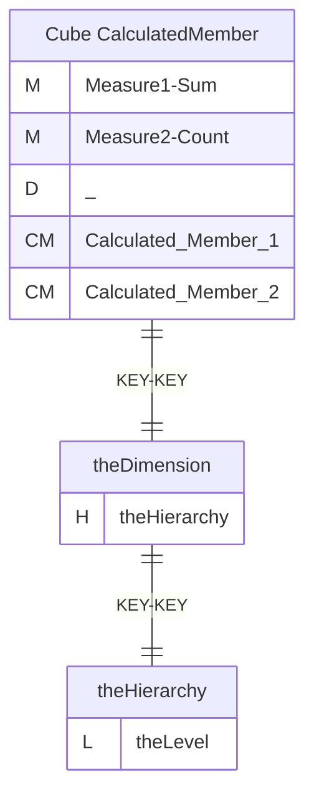
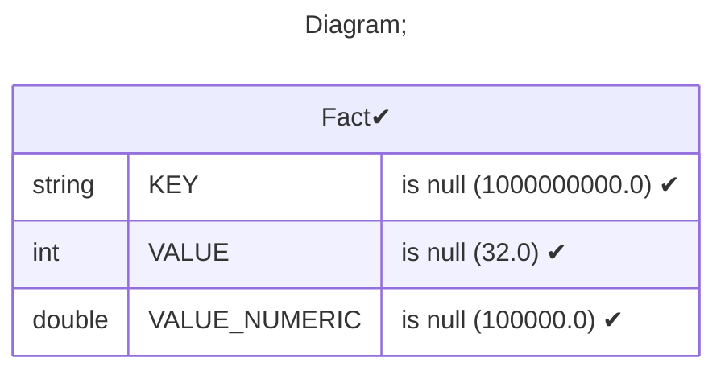
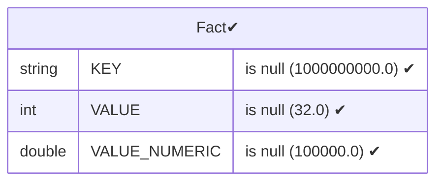
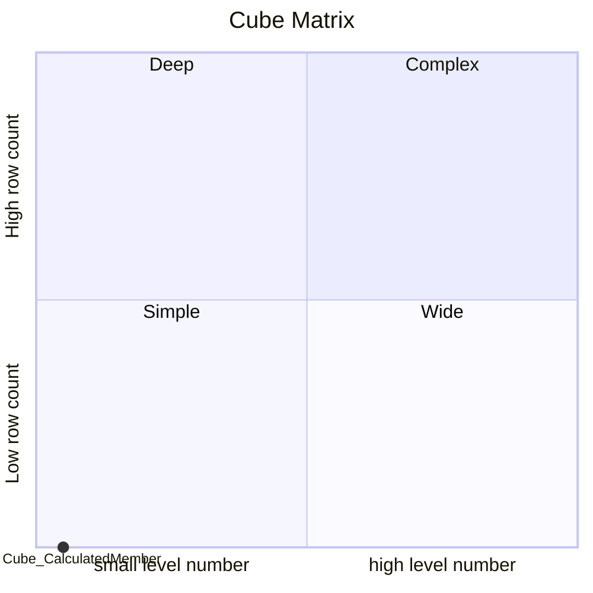

# Documentation
### CatalogName : Cube - CalculatedMembers Intro
### Schema Cube - CalculatedMembers Intro : 
---
### Cubes :

    Cube CalculatedMember

---
#### Cube "Cube CalculatedMember":

    

##### Table: "Fact"

##### Dimensions:
##### Dimension "":

Hierarchies:

    theHierarchy

##### Hierarchy theHierarchy:

Tables: "Fact"

Levels: "theLevel"

###### Level "theLevel" :

    column(s): KEY

### Cube "Cube CalculatedMember" diagram:

---

---
### Database :
---

---
" Aggregation section:

---

---
### Cube Matrix for Cube - CalculatedMembers Intro:

---
### Database :
---

---
