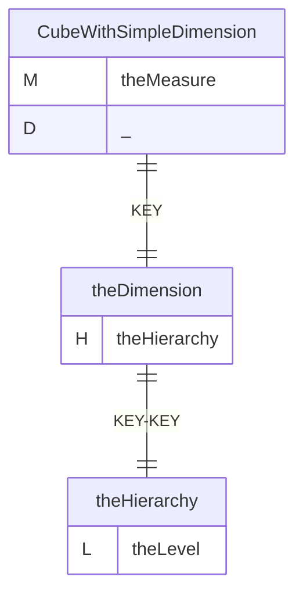
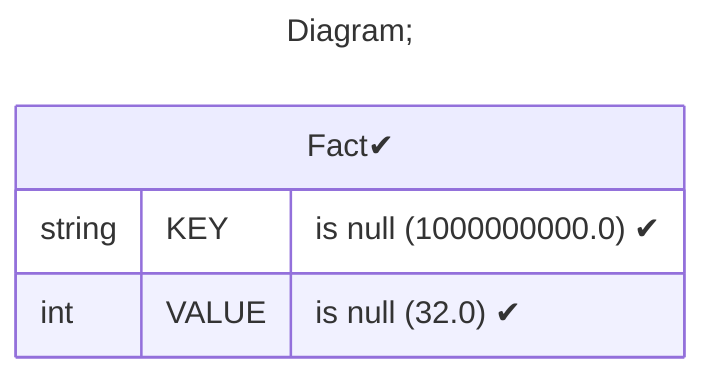
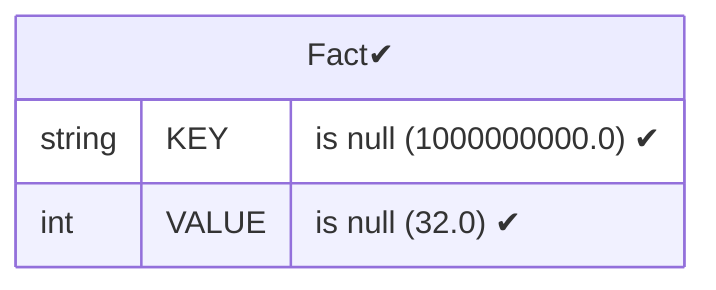
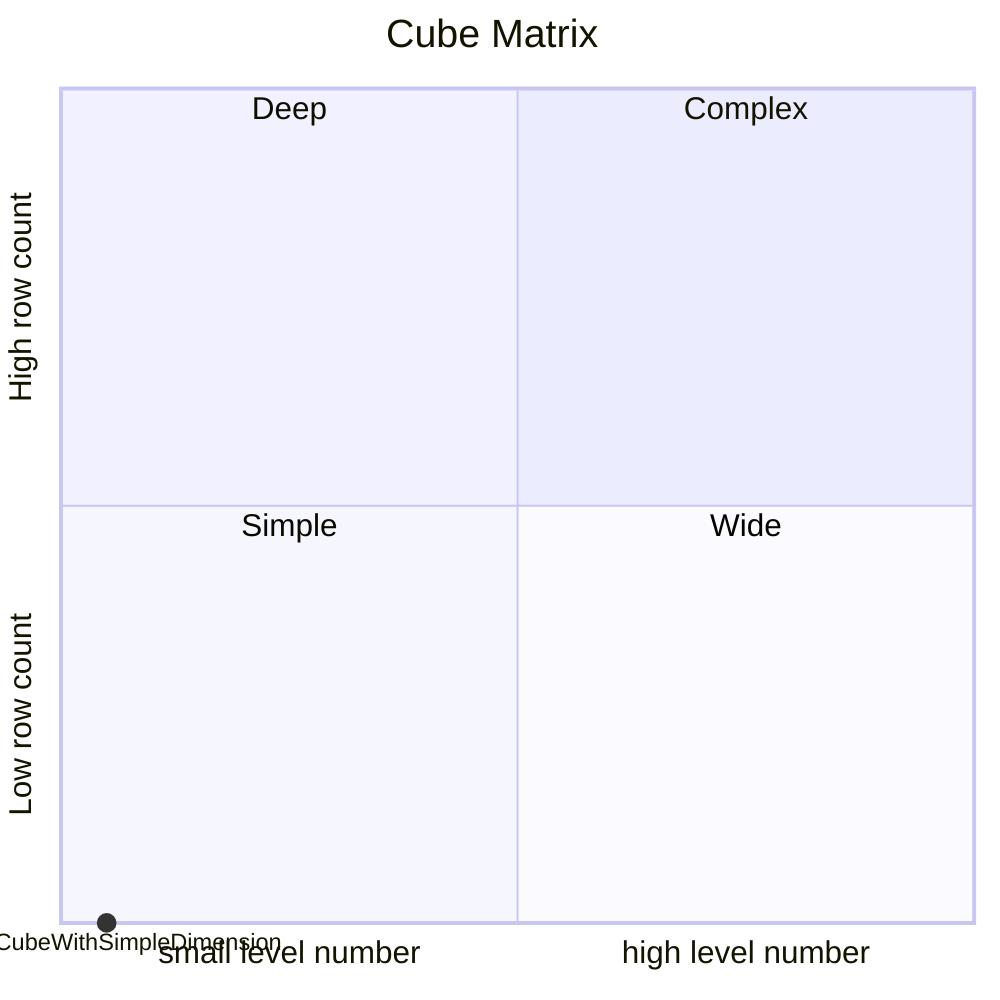

# Documentation
### CatalogName : Dimension - Introduction
### Schema Dimension - Introduction : 
---
### Cubes :

    CubeWithSimpleDimension

---
#### Cube "CubeWithSimpleDimension":

    

##### Table: "Fact"

##### Dimensions:
##### Dimension "":

Hierarchies:

    theHierarchy

##### Hierarchy theHierarchy:

Tables: "Fact"

Levels: "theLevel"

###### Level "theLevel" :

    column(s): KEY

### Cube "CubeWithSimpleDimension" diagram:

---

---
### Database :
---

---
" Aggregation section:

---

---
### Cube Matrix for Dimension - Introduction:

---
### Database :
---

---
## Validation result for catalog Dimension - Introduction
## WARNING : 
|Type|   |
|----|---|
|DATABASE|Table: Schema must be set|
