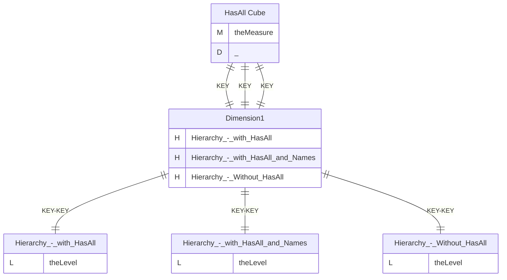
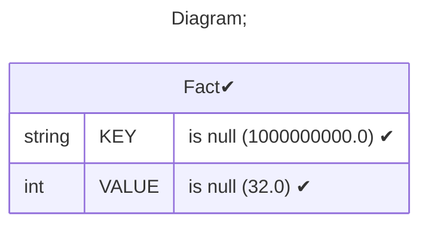
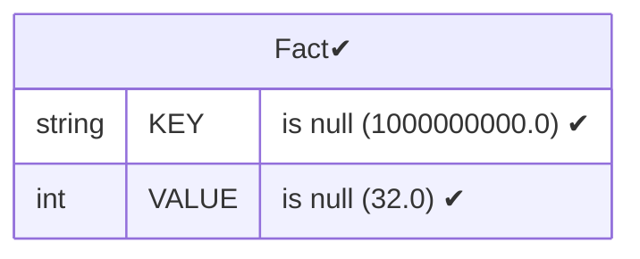
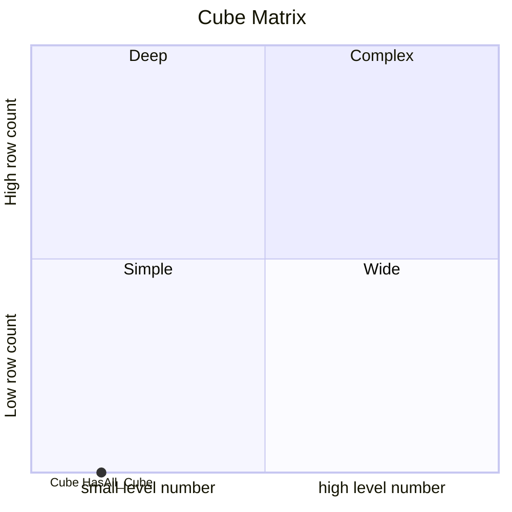

# Documentation
### CatalogName : Hierarchy - HasAll-Level
### Schema Hierarchy - HasAll-Level : 
---
### Cubes :

    HasAll Cube

---
#### Cube "HasAll Cube":

    

##### Table: "Fact"

##### Dimensions:
##### Dimension "":

Hierarchies:

    Hierarchy - with HasAll, Hierarchy - with HasAll and Names, Hierarchy - Without HasAll

##### Hierarchy Hierarchy - with HasAll:

Tables: "Fact"

Levels: "theLevel"

###### Level "theLevel" :

    column(s): KEY

##### Hierarchy Hierarchy - with HasAll and Names:

Tables: "Fact"

Levels: "theLevel"

###### Level "theLevel" :

    column(s): KEY

##### Hierarchy Hierarchy - Without HasAll:

Tables: "Fact"

Levels: "theLevel"

###### Level "theLevel" :

    column(s): KEY

### Cube "HasAll Cube" diagram:

---

---
### Database :
---

---
" Aggregation section:

---

---
### Cube Matrix for Hierarchy - HasAll-Level:

---
### Database :
---

---
## Validation result for catalog Hierarchy - HasAll-Level
## ERROR : 
|Type|   |
|----|---|
|SCHEMA|Dimension connector override name must be set for cube with name HasAll Cube|
|SCHEMA|Hierarchy: Table field must be empty in dimension with name Dimension1|
|DATABASE|Hierarchy: Table value does not correspond to Hierarchy Relation  in dimension with name Dimension1|
## WARNING : 
|Type|   |
|----|---|
|DATABASE|Table: Schema must be set|
