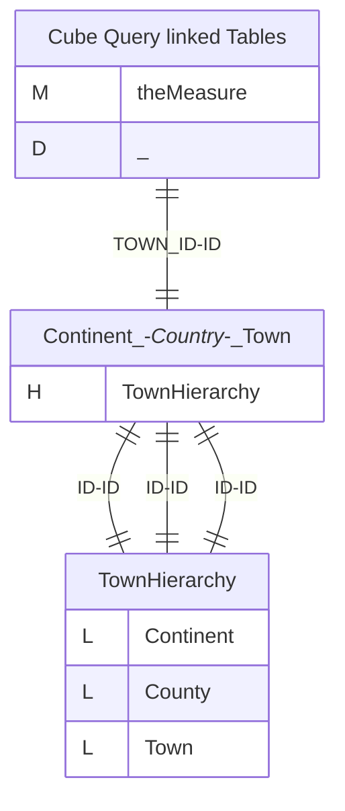
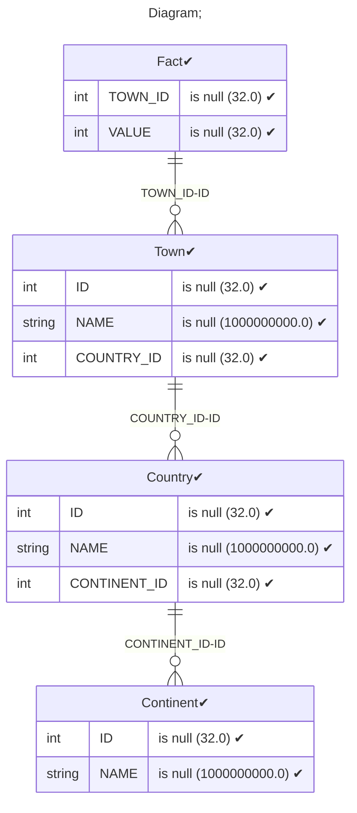
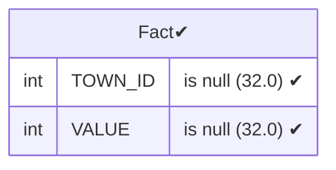
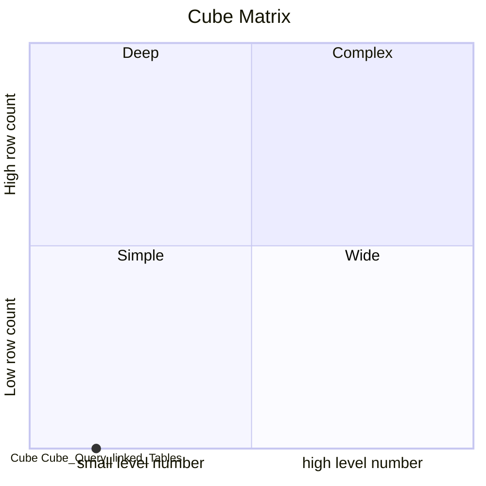

# Documentation
### CatalogName : Hierarchy - Query based on a 2 Joind with 3 Levels
### Schema Hierarchy - Query based on a 2 Joind with 3 Levels : 
---
### Cubes :

    Cube Query linked Tables

---
#### Cube "Cube Query linked Tables":

    

##### Table: "Fact"

##### Dimensions:
##### Dimension "":

Hierarchies:

    TownHierarchy

##### Hierarchy TownHierarchy:

Tables: "Town,Country,Continent"

Levels: "Continent, County, Town"

###### Level "Continent" :

    column(s): ID

###### Level "County" :

    column(s): ID

###### Level "Town" :

    column(s): ID

### Cube "Cube Query linked Tables" diagram:

---

---
### Database :
---

---
" Aggregation section:

---

---
### Cube Matrix for Hierarchy - Query based on a 2 Joind with 3 Levels:

---
### Database :
---

---
