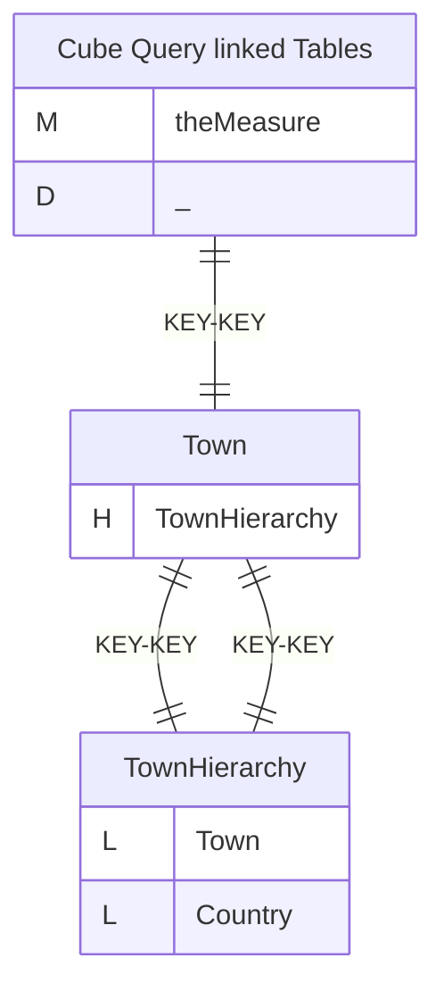
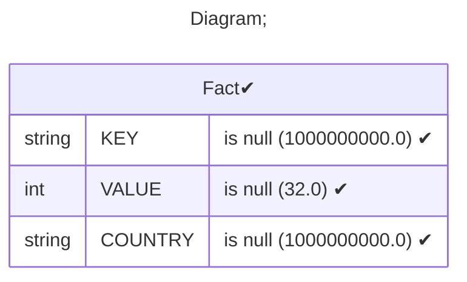
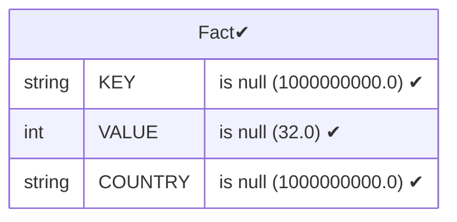
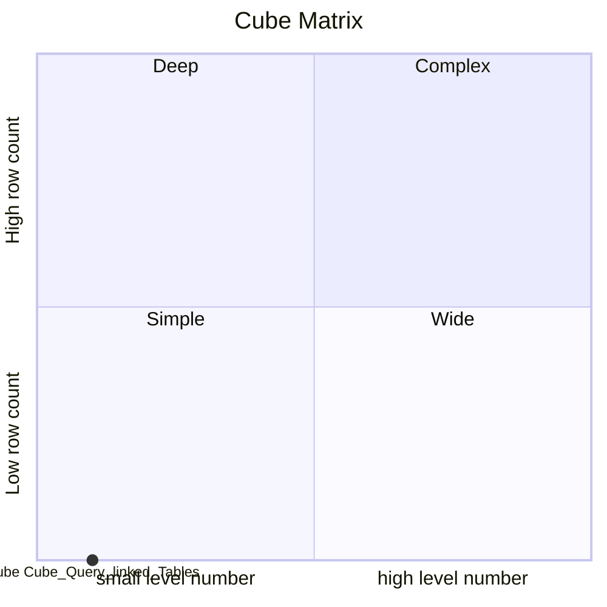

# Documentation
### CatalogName : Hierarchy - Query based on all in one Table
### Schema Hierarchy - Query based on all in one Table : 
---
### Cubes :

    Cube Query linked Tables

---
#### Cube "Cube Query linked Tables":

    

##### Table: "Fact"

##### Dimensions:
##### Dimension "":

Hierarchies:

    TownHierarchy

##### Hierarchy TownHierarchy:

Tables: "Fact"

Levels: "Town, Country"

###### Level "Town" :

    column(s): KEY

###### Level "Country" :

    column(s): KEY

### Cube "Cube Query linked Tables" diagram:

---

---
### Database :
---

---
" Aggregation section:

---

---
### Cube Matrix for Hierarchy - Query based on all in one Table:

---
### Database :
---

---
