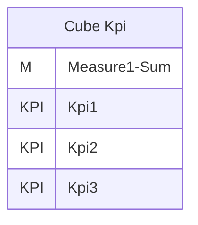
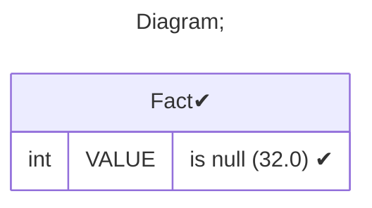
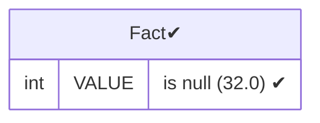
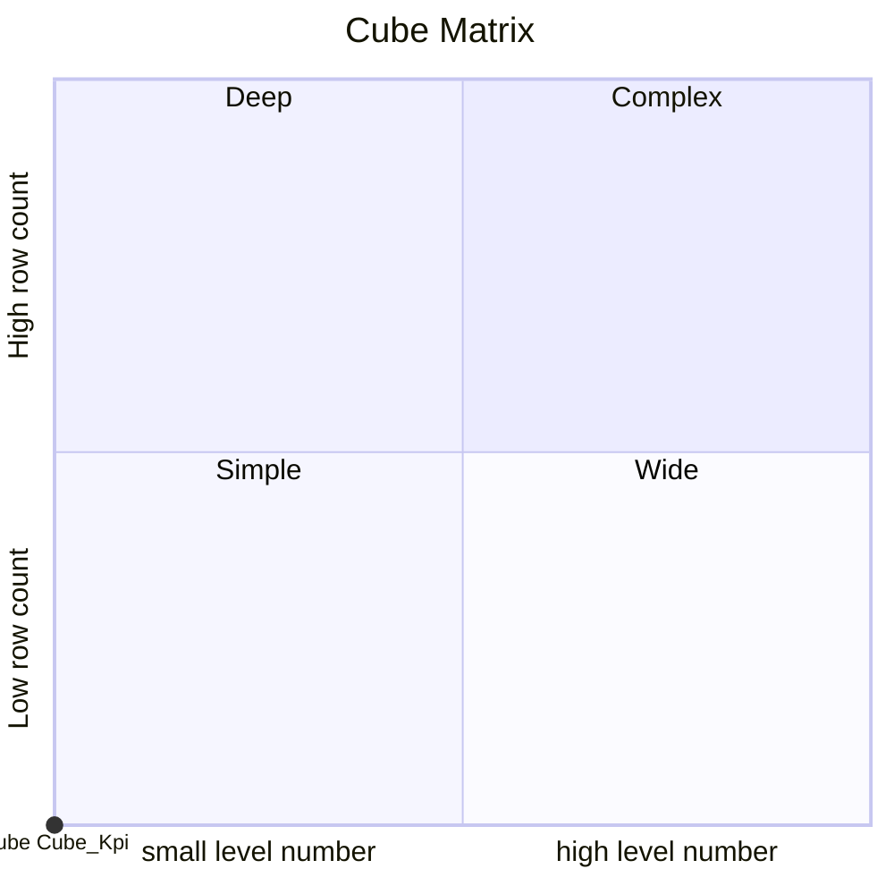

# Documentation
### CatalogName : Cube - KPI Introduction
### Schema Cube - KPI Introduction : 
---
### Cubes :

    Cube Kpi

---
#### Cube "Cube Kpi":

    

##### Table: "Fact"

### Cube "Cube Kpi" diagram:

---

---
### Database :
---

---
" Aggregation section:

---

---
### Cube Matrix for Cube - KPI Introduction:

---
### Database :
---

---
