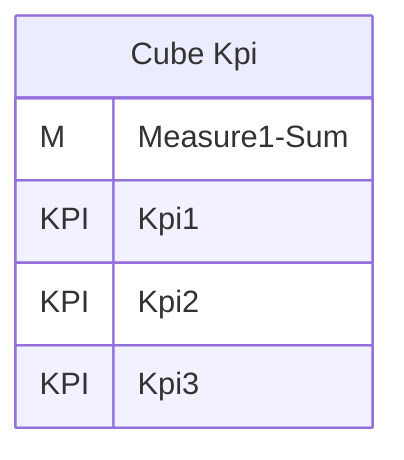
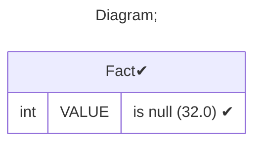
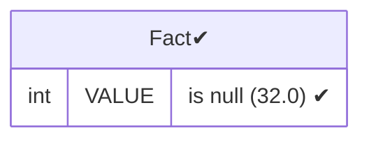
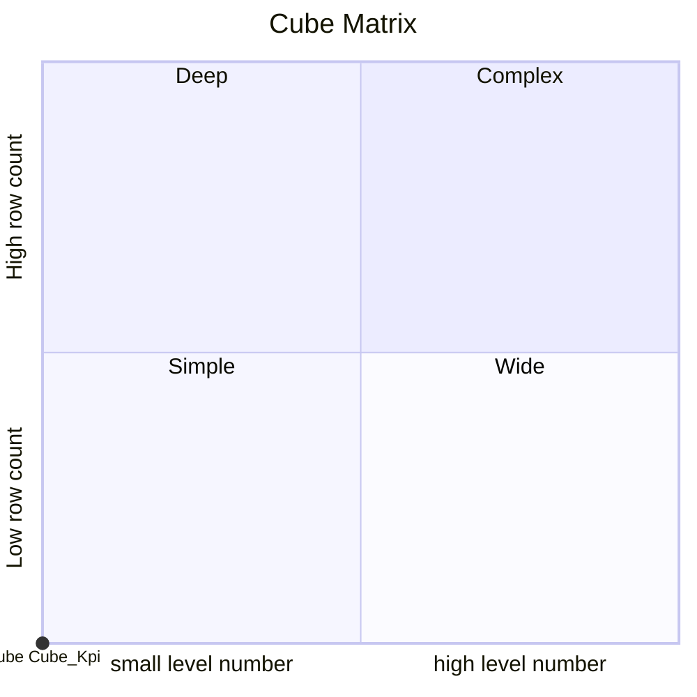

# Documentation
### CatalogName : Cube - KPI parent ring
### Schema Cube - KPI parent ring : 
---
### Cubes :

    Cube Kpi

---
#### Cube "Cube Kpi":

    

##### Table: "Fact"

### Cube "Cube Kpi" diagram:

---

---
### Database :
---

---
" Aggregation section:

---

---
### Cube Matrix for Cube - KPI parent ring:

---
### Database :
---

---
## Validation result for catalog Cube - KPI parent ring
## WARNING : 
|Type|   |
|----|---|
|SCHEMA|KPIs from cube with name Cube Kpi has parent ring|
|DATABASE|Table: Schema must be set|
