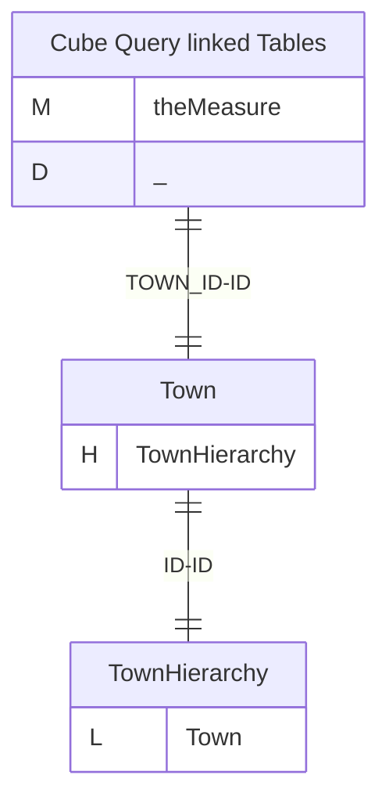
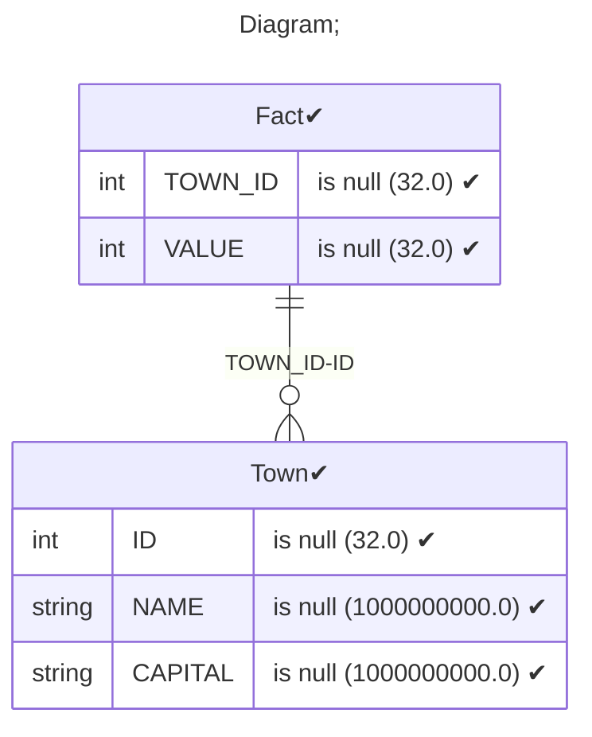
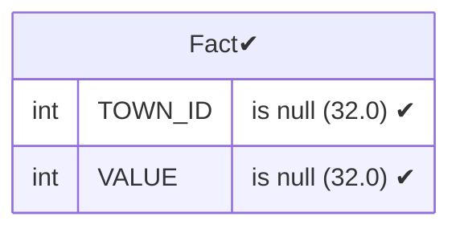
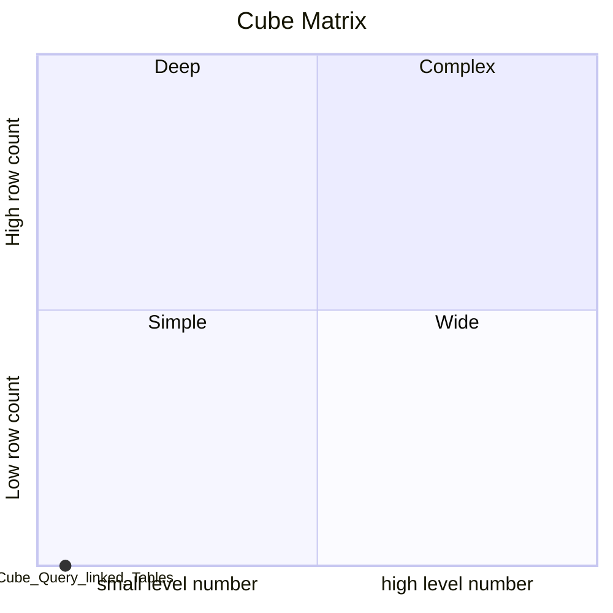

# Documentation
### CatalogName : Level - MemberProperties Intro
### Schema Level - MemberProperties Intro : 
---
### Cubes :

    Cube Query linked Tables

---
#### Cube "Cube Query linked Tables":

    

##### Table: "Fact"

##### Dimensions:
##### Dimension "":

Hierarchies:

    TownHierarchy

##### Hierarchy TownHierarchy:

Tables: "Town"

Levels: "Town"

###### Level "Town" :

    column(s): ID

### Cube "Cube Query linked Tables" diagram:

---

---
### Database :
---

---
" Aggregation section:

---

---
### Cube Matrix for Level - MemberProperties Intro:

---
### Database :
---

---
## Validation result for catalog Level - MemberProperties Intro
## WARNING : 
|Type|   |
|----|---|
|DATABASE|Table: Schema must be set|
