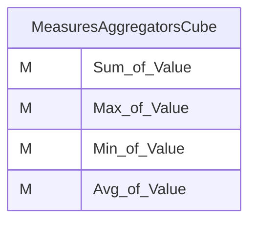
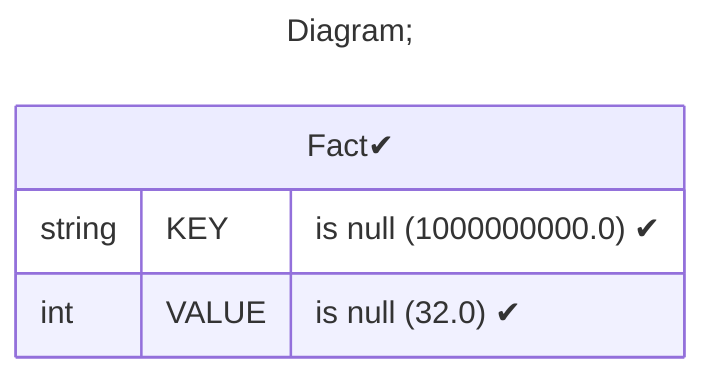
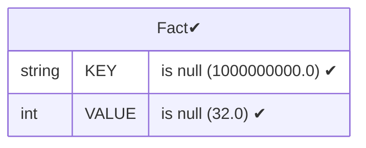
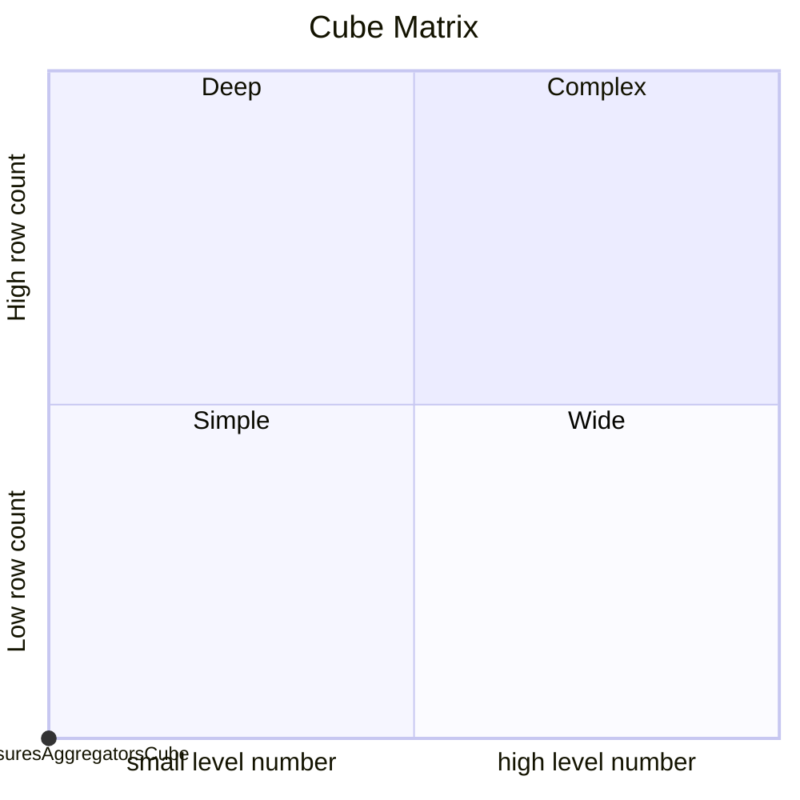

# Documentation
### CatalogName : Cube - Measures and Aggregators
### Schema Cube - Measures and Aggregators : 
---
### Cubes :

    MeasuresAggregatorsCube

---
#### Cube "MeasuresAggregatorsCube":

    

##### Table: "Fact"

### Cube "MeasuresAggregatorsCube" diagram:

---

---
### Database :
---

---
" Aggregation section:

---

---
### Cube Matrix for Cube - Measures and Aggregators:

---
### Database :
---

---
