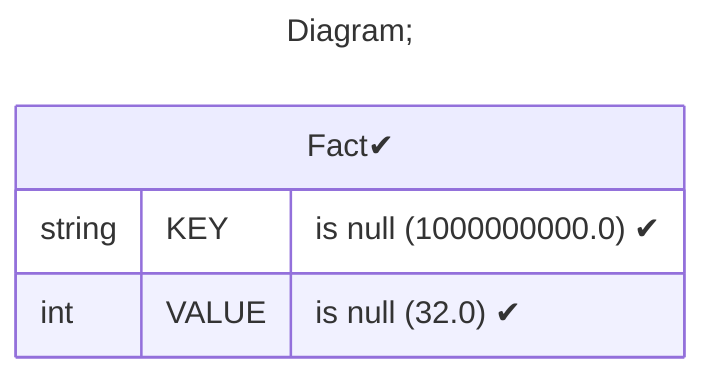
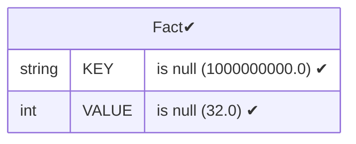
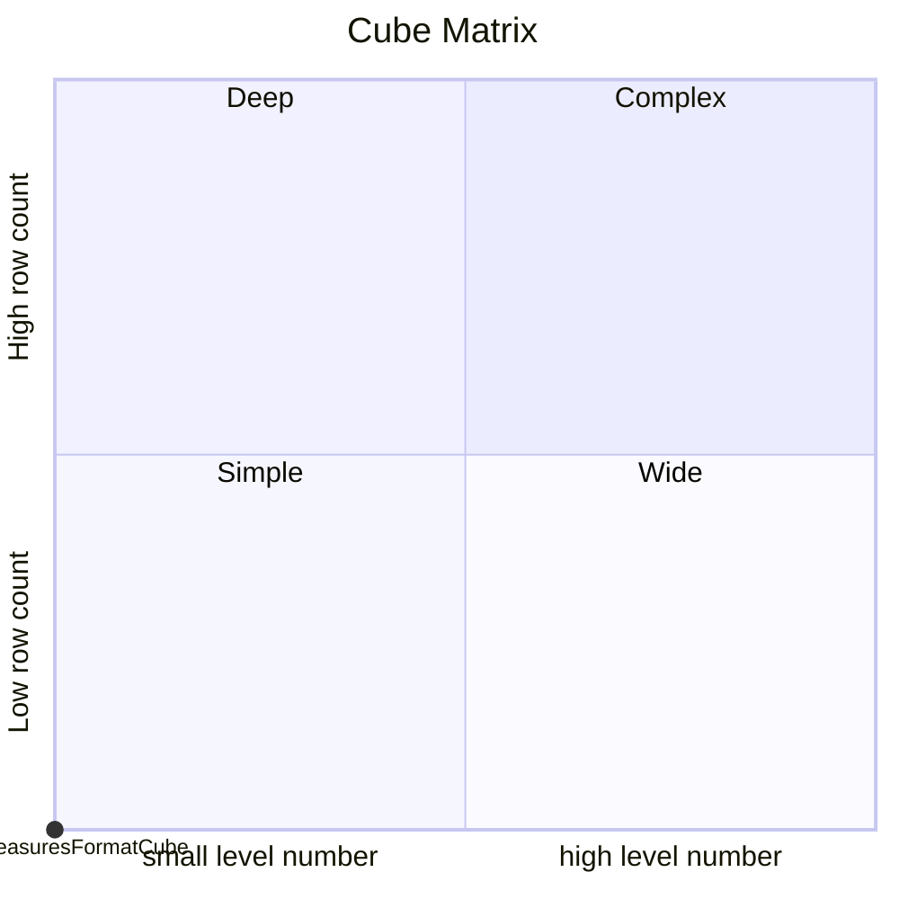

# Documentation
### CatalogName : Cube - Measures and Formats
### Schema Cube - Measures and Formats : 
---
### Cubes :

    MeasuresFormatCube

---
#### Cube "MeasuresFormatCube":

    

##### Table: "Fact"

### Cube "MeasuresFormatCube" diagram:

---

```mermaid
%%{init: {
"theme": "default",
"themeCSS": [
    ".er.entityBox {stroke: black;}",
    ".er.attributeBoxEven {stroke: black;}",
    ".er.attributeBoxOdd {stroke: black;}",
    "[id^=entity-c] .er.entityBox { fill: lightgreen;} ",
    "[id^=entity-d] .er.entityBox { fill: powderblue;} ",
    "[id^=entity-h] .er.entityBox { fill: pink;} "
]
}}%%
erDiagram
c0["MeasuresFormatCube"]{
M Format_#,##0_00 ""
M Format_#,##0 ""
M Format_#,##0_ ""
}
```
---
### Database :
---

---
" Aggregation section:

---

---
### Cube Matrix for Cube - Measures and Formats:

---
### Database :
---

---
