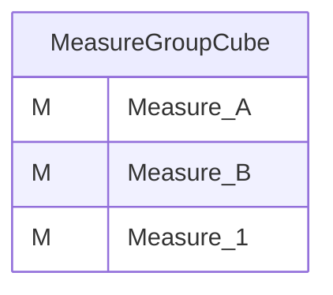
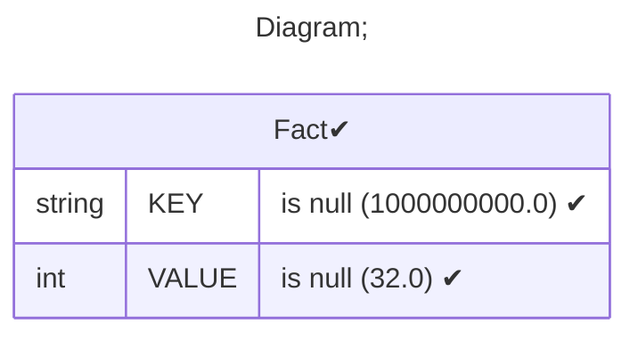
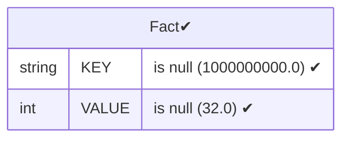
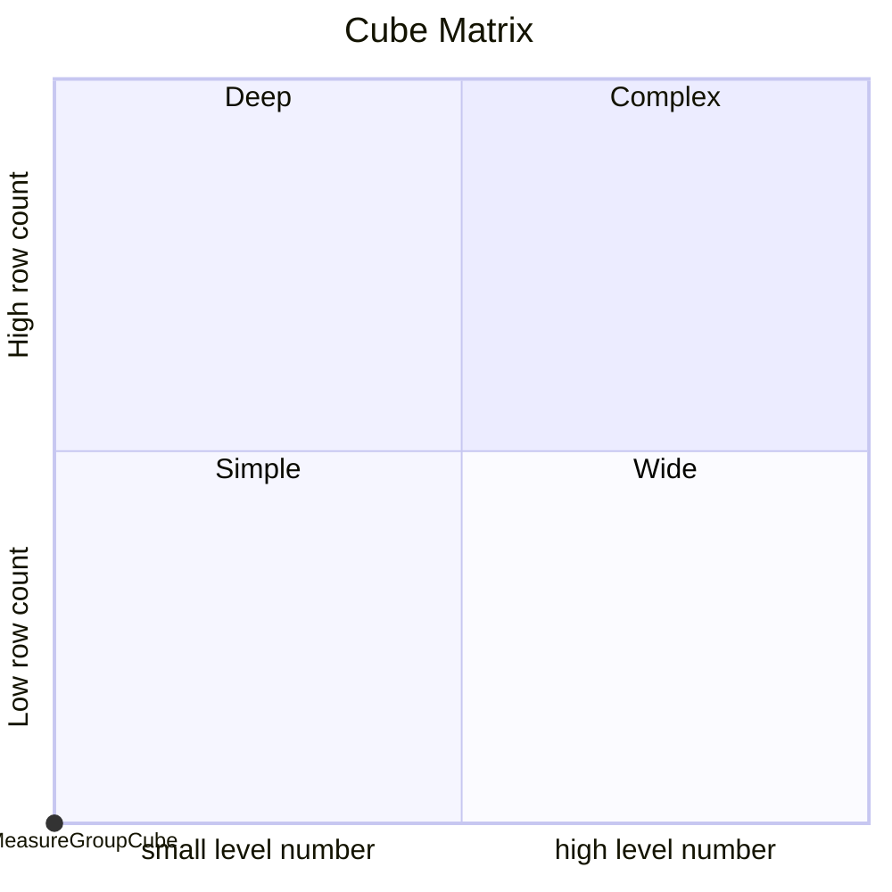

# Documentation
### CatalogName : Cube - Measures and MeasureGroups
### Schema Cube - Measures and MeasureGroups : 
---
### Cubes :

    MeasureGroupCube

---
#### Cube "MeasureGroupCube":

    

##### Table: "Fact"

### Cube "MeasureGroupCube" diagram:

---

---
### Database :
---

---
" Aggregation section:

---

---
### Cube Matrix for Cube - Measures and MeasureGroups:

---
### Database :
---

---
## Validation result for catalog Cube - Measures and MeasureGroups
## WARNING : 
|Type|   |
|----|---|
|DATABASE|Table: Schema must be set|
