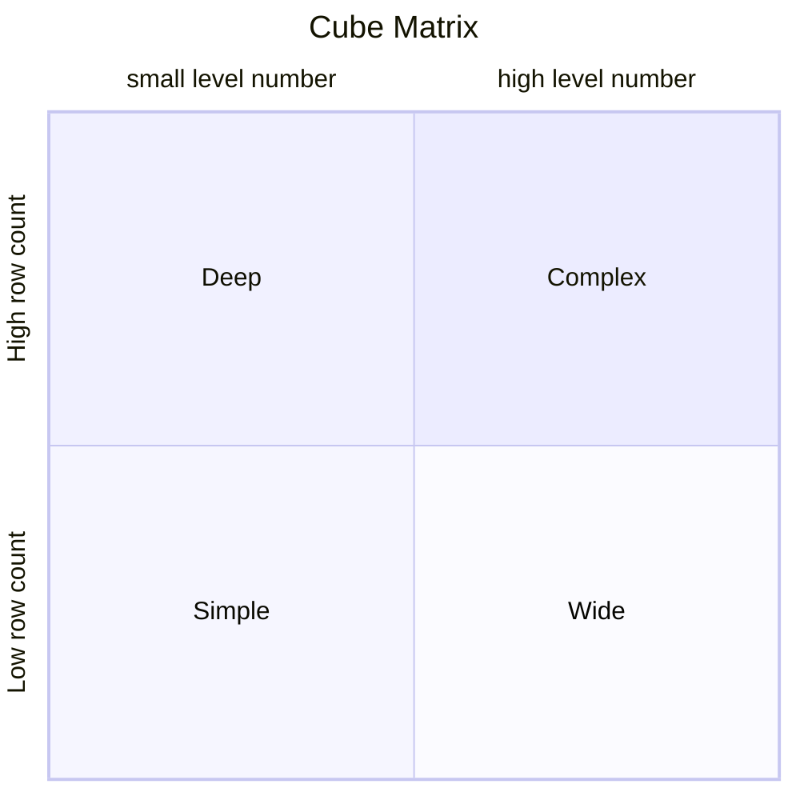
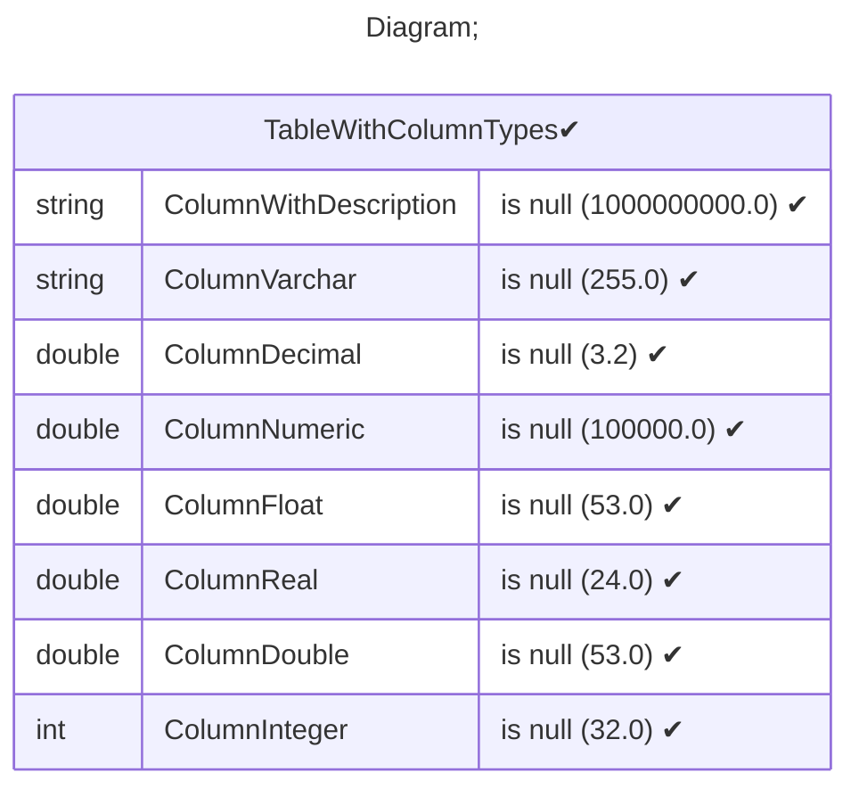

# Documentation
### CatalogName : Database - ColumnTypes
### Schema Database - ColumnTypes : 
---
### Cubes :

    

### Cube Matrix for Database - ColumnTypes:

```mermaid
quadrantChart
title Cube Matrix
x-axis small level number --> high level number
y-axis Low row count --> High row count
quadrant-1 Complex
quadrant-2 Deep
quadrant-3 Simple
quadrant-4 Wide

```
---
### Database :
---

```mermaid
---
title: Diagram;
---
erDiagram
"TableWithColumnTypes✔"{
string ColumnWithDescription "is null (1000000000.0) ✔"
string ColumnVarchar "is null (255.0) ✔"
double ColumnDecimal "is null (3.2) ✔"
double ColumnNumeric "is null (100000.0) ✔"
double ColumnFloat "is null (53.0) ✔"
double ColumnReal "is null (24.0) ✔"
double ColumnDouble "is null (53.0) ✔"
int ColumnInteger "is null (32.0) ✔"
}

```
---
