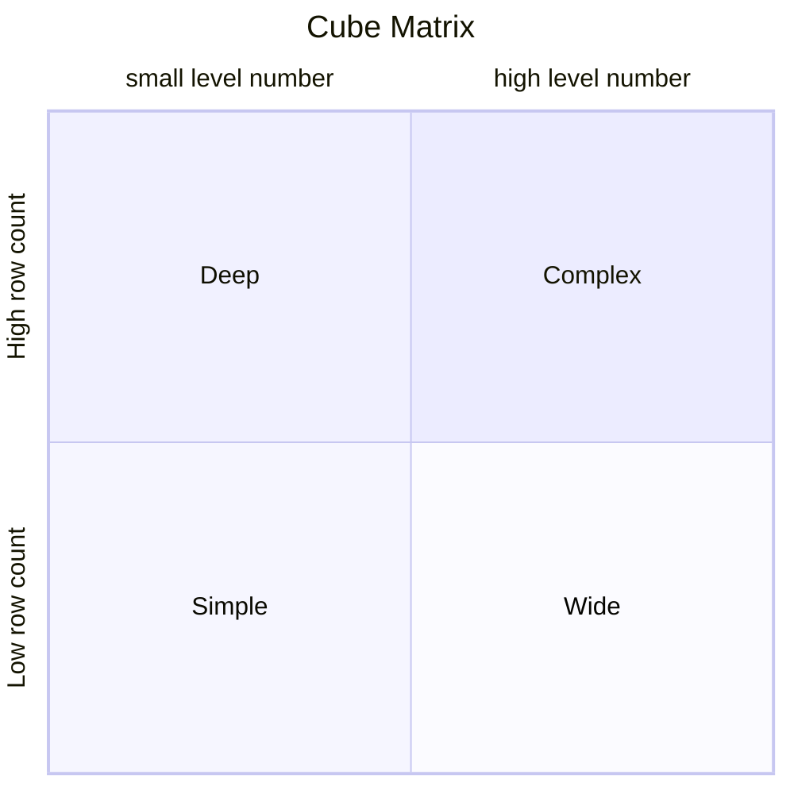

# Documentation
### CatalogName : Database - SQL Expression Column
### Schema Database - SQL Expression Column : 
---
### Cubes :

    

### Cube Matrix for Database - SQL Expression Column:

```mermaid
quadrantChart
title Cube Matrix
x-axis small level number --> high level number
y-axis Low row count --> High row count
quadrant-1 Complex
quadrant-2 Deep
quadrant-3 Simple
quadrant-4 Wide

```
---
