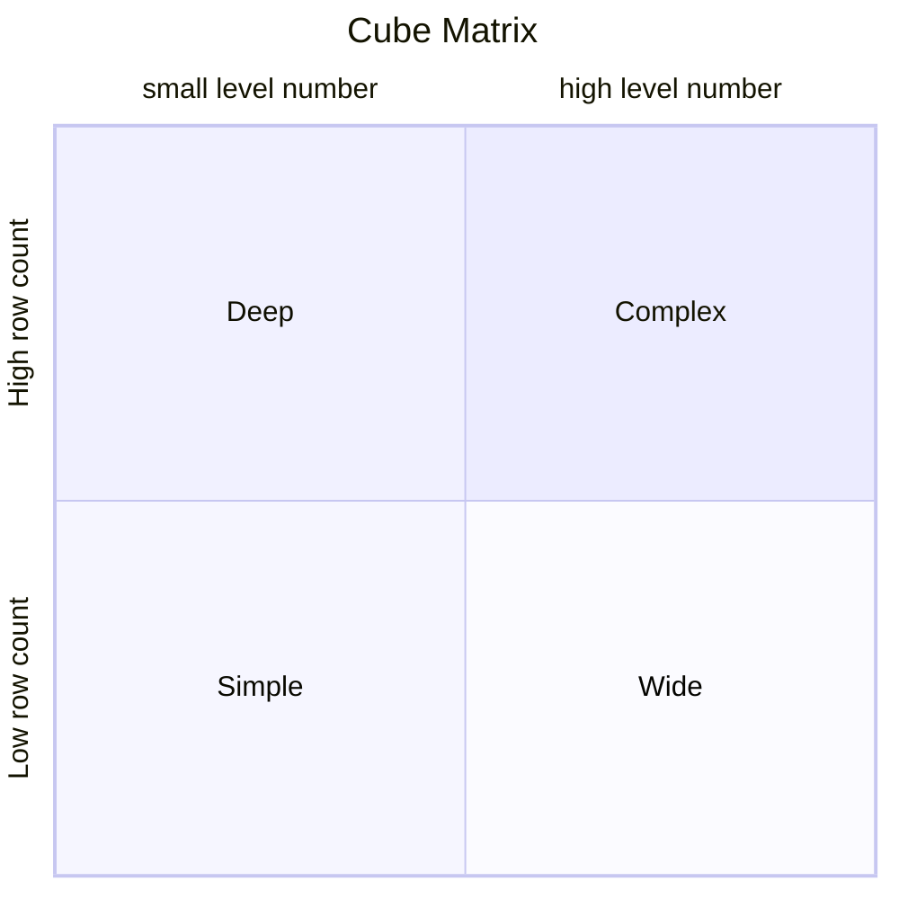
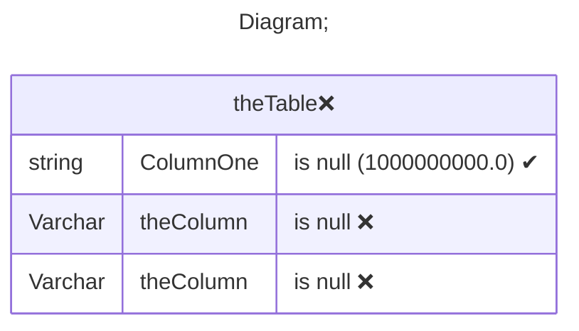

# Documentation
### CatalogName : Database - Schema
### Schema Database - Schema : 
---
### Cubes :

    

### Cube Matrix for Database - Schema:

```mermaid
quadrantChart
title Cube Matrix
x-axis small level number --> high level number
y-axis Low row count --> High row count
quadrant-1 Complex
quadrant-2 Deep
quadrant-3 Simple
quadrant-4 Wide

```
---
### Database :
---

```mermaid
---
title: Diagram;
---
erDiagram
"theTable❌"{
string ColumnOne "is null (1000000000.0) ✔"
Varchar theColumn "is null ❌"
Varchar theColumn "is null ❌"
}

```
---
