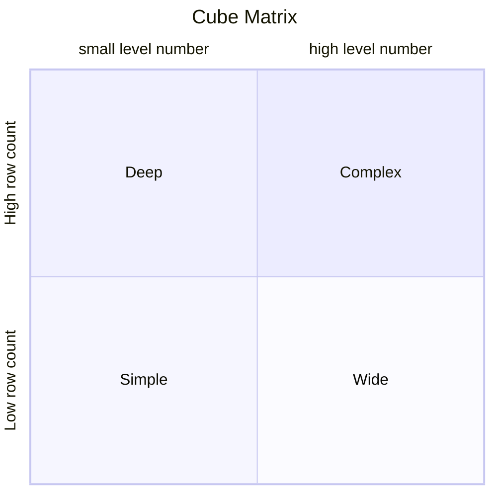
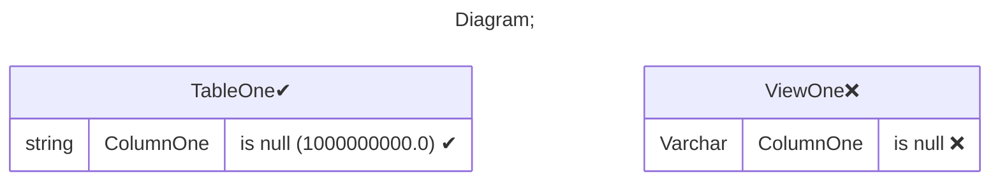

# Documentation
### CatalogName : Database - Table
### Schema Database - Table : 
---
### Cubes :

    

### Cube Matrix for Database - Table:

---
### Database :
---

---
## Validation result for catalog Database - Table
## ERROR : 
|Type|   |
|----|---|
|DATABASE|Table ViewOne does not exist in database|
